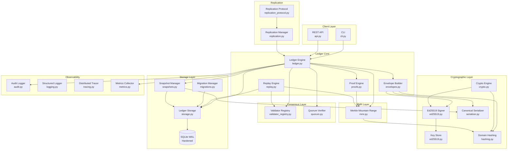
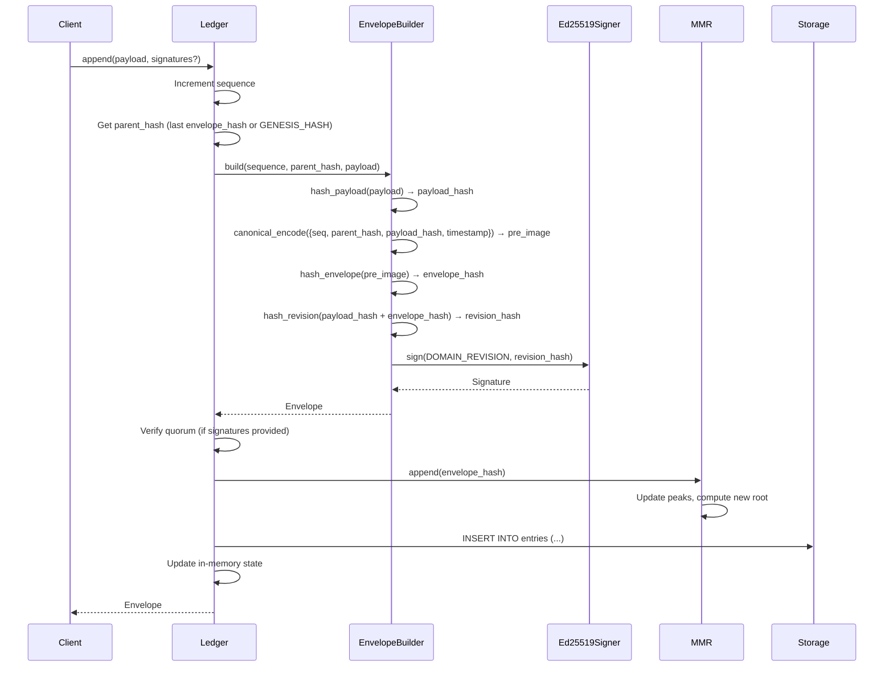
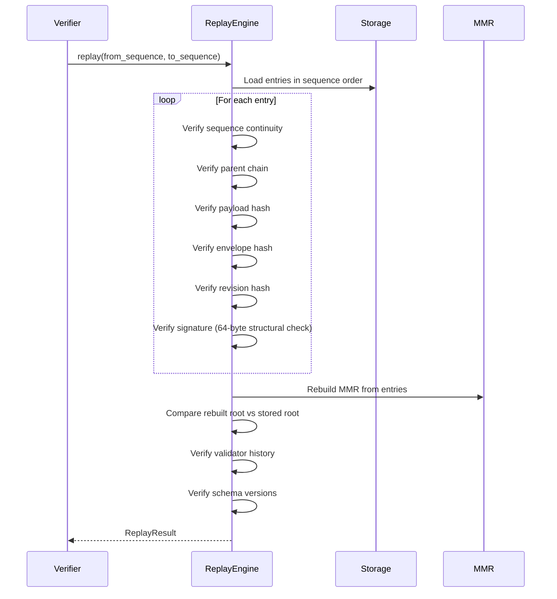
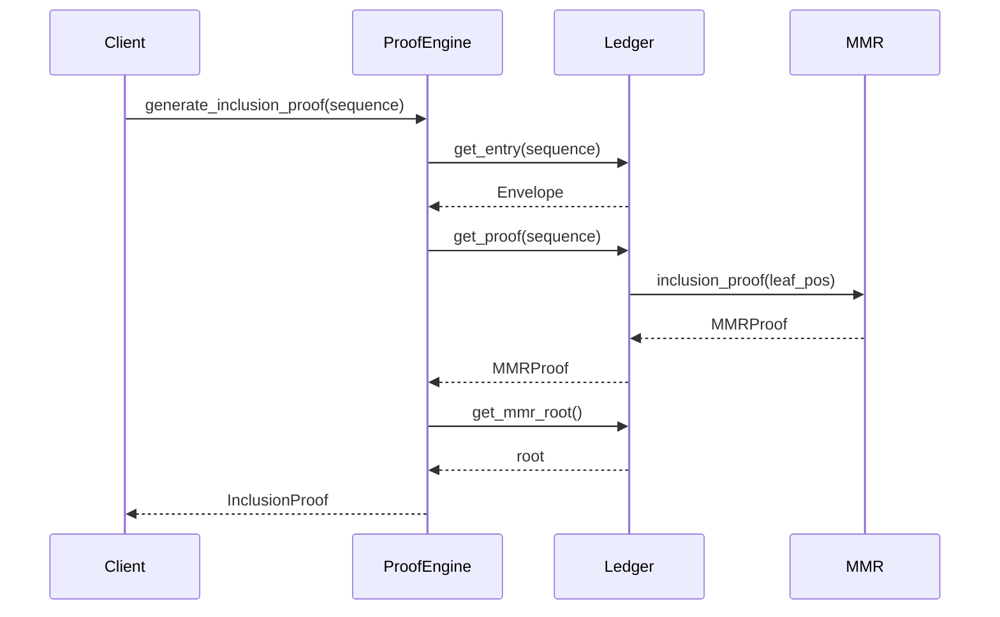
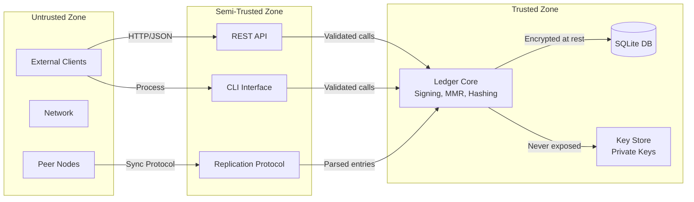
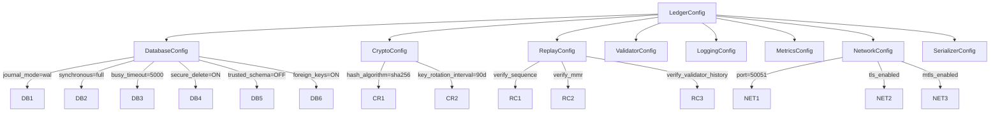
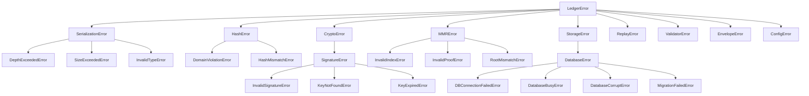
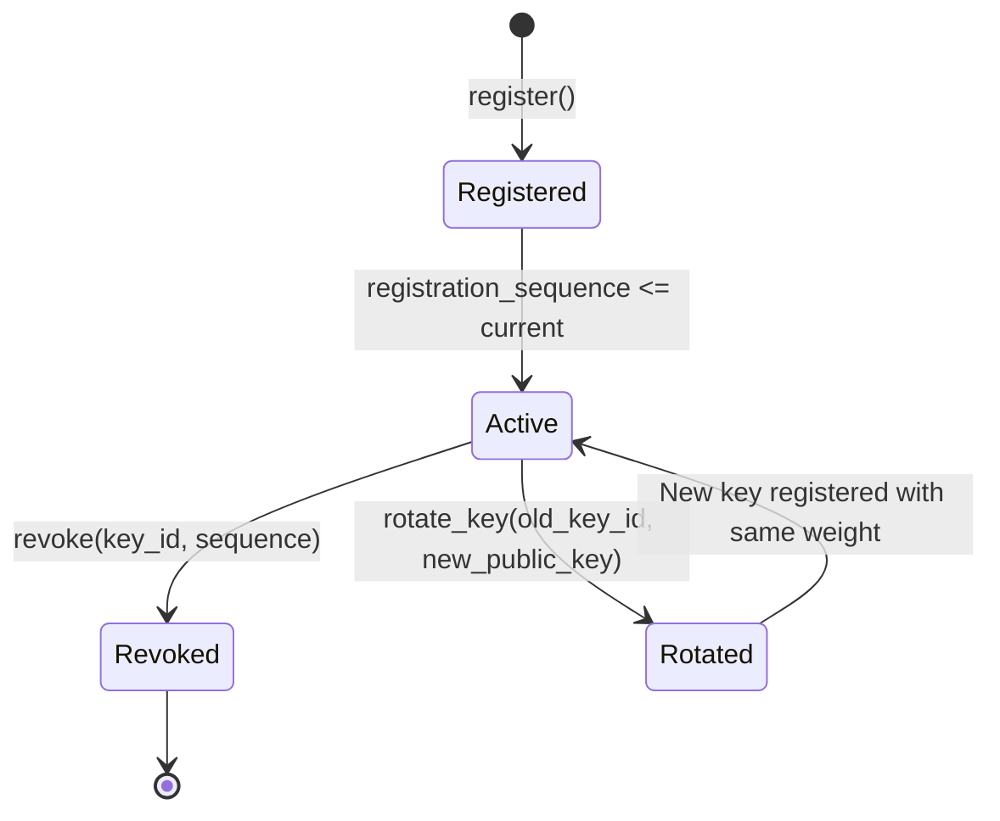
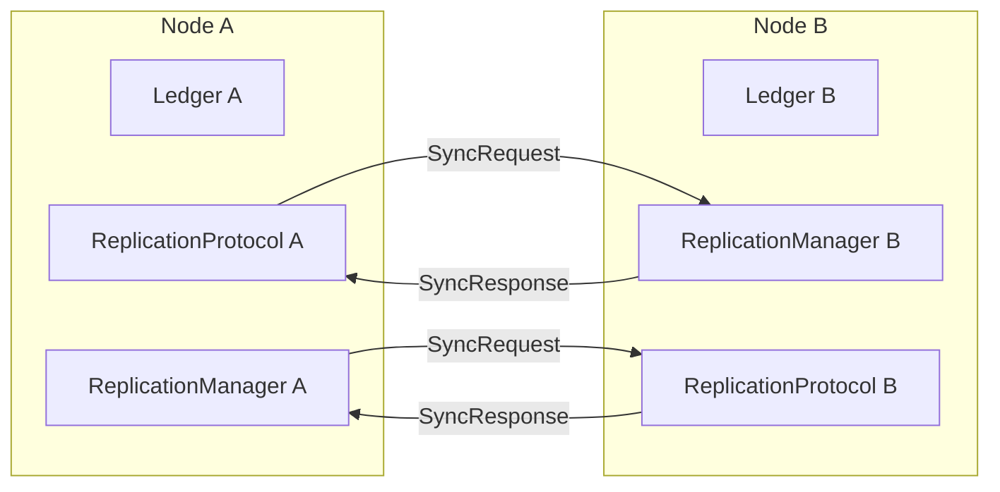

# VVU Earth Tech Ledger — System Architecture

## 1. Overview

The VVU Earth Tech Ledger is a **deterministic, cryptographically verifiable production ledger** designed for environments where data integrity, auditability, and replay verification are non-negotiable. Every entry appended to the ledger is:

1. **Cryptographically signed** using Ed25519 with domain-separated hashing
2. **Hash-chained** into an append-only sequence linked by envelope hashes
3. **Merkle-indexed** via a Merkle Mountain Range (MMR) for efficient inclusion and consistency proofs
4. **Replay-verifiable** — the entire ledger can be reconstructed from genesis and every integrity property checked independently

The ledger is designed for **deterministic replay**: given the same sequence of entries, any verifier can independently reconstruct the identical state and verify all hashes, signatures, and proofs.

## 2. Component Diagram



## 3. Domain Separation — The Eight Domains

The system is partitioned into eight cryptographic domains, each with a unique prefix. Domain separation ensures that hashes and signatures computed under one domain are cryptographically independent from those computed under any other domain, even if the underlying data is identical.

| Domain | Prefix | Purpose |
|--------|--------|---------|
| **Payload** | `VVU:PAYLOAD:1:` | Hashing raw payload data |
| **Envelope** | `VVU:ENVELOPE:1:` | Hashing envelope pre-images |
| **Revision** | `VVU:REVISION:1:` | Hashing payload+envelope composite; signing domain |
| **MMR Internal** | `VVU:MMR:INT:1:` | MMR leaf and branch node hashing |
| **MMR Bagging** | `VVU:MMR:BAG:1:` | MMR peak bagging (root computation) |
| **Snapshot** | `VVU:SNAP:1:` | Snapshot integrity hashing |
| **Replay** | `VVU:REPLAY:1:` | Replay verification context |
| **Proof** | `VVU:PROOF:1:` | Proof integrity hashing |

Additionally, `VVU:KEYROT:1:` is used for key rotation operations.

The domain hash construction is:

```
domain_hash(domain, data) = SHA-256(domain ‖ len(domain)₄ ‖ data)
```

Where `len(domain)₄` is the domain length as a 4-byte big-endian unsigned integer.

## 4. Data Flow

### 4.1 Append Flow



### 4.2 Verification Flow



### 4.3 Proof Generation Flow



## 5. Trust Boundaries



### Trust Boundary Rules

1. **Private keys never leave the Trusted Zone** — the `KeyPair.signing_key` field is never exposed outside the `ed25519` module.
2. **All external inputs are validated** — the API and CLI validate all inputs before passing them to the core.
3. **Replication entries are parsed but not directly applied** — the `handle_sync_response` method currently returns 0 because the hash chain must be preserved through the normal append path.
4. **Database is accessed only through `LedgerStorage`** — no raw SQL is executed outside the storage layer.

## 6. Module Decomposition

### 6.1 Core Modules

| Module | Responsibility |
|--------|---------------|
| `serializer` | Deterministic canonical binary encoding/decoding with version header `VVU\x01` |
| `hashing` | Domain-separated SHA-256 hashing with protocol-specific convenience functions |
| `ed25519` | Ed25519 signing, verification, key management, rotation, and revocation |
| `mmr` | Merkle Mountain Range — append-only tree with inclusion and consistency proofs |
| `storage` | Hardened SQLite storage engine with production PRAGMAs |
| `config` | Frozen dataclass-based configuration system with TOML support |
| `constants` | Protocol constants, domain separation prefixes, and limits |
| `exceptions` | Complete exception hierarchy with machine-readable codes |

### 6.2 Application Modules

| Module | Responsibility |
|--------|---------------|
| `envelopes` | Envelope construction — hash chain computation and signing |
| `ledger` | Central coordinator — ties storage, signing, MMR, and validators together |
| `replay` | Replay engine — reconstructs and verifies the ledger from genesis |
| `proofs` | Proof engine — generates and verifies inclusion, consistency, and receipt proofs |
| `validator_registry` | Validator lifecycle — registration, revocation, key rotation, historical lookup |
| `quorum` | Quorum verification — checks if validator signatures achieve threshold |
| `snapshots` | Point-in-time state capture with integrity verification |
| `migrations` | Versioned database schema evolution |
| `api` | REST API layer (HTTP/JSON) |
| `cli` | Command-line interface |

### 6.3 Infrastructure Modules

| Module | Responsibility |
|--------|---------------|
| `logging` | Structured JSON logging with correlation IDs |
| `tracing` | Distributed tracing with span creation and OpenTelemetry output |
| `metrics` | Observability metrics (Prometheus exposition format) |
| `audit` | Audit logging for compliance |
| `replication` | Multi-node replication state management |
| `replication_protocol` | Replication wire protocol handler |
| `version` | Version information |

## 7. Configuration Architecture

All configuration is managed through frozen dataclasses with validation in `__post_init__`:



Configuration can be loaded from:

1. **Default** — `LedgerConfig.default()` with production-safe values
2. **TOML** — `LedgerConfig.from_toml(path)` for environment-specific overrides

## 8. Error Handling Strategy

All exceptions inherit from `LedgerError` and carry:

- **Machine-readable code** — e.g., `HASH_DOMAIN_VIOLATION`, `DATABASE_NOT_OPEN`
- **Optional detail dict** — structured context for programmatic inspection
- **Proper hierarchy** — callers can catch at the appropriate granularity



## 9. Database Schema

### 9.1 Tables

**metadata** — Key-value store for schema version and other metadata:

| Column | Type | Description |
|--------|------|-------------|
| key | TEXT PRIMARY KEY | Metadata key |
| value | TEXT NOT NULL | Metadata value |

**entries** — The append-only ledger:

| Column | Type | Description |
|--------|------|-------------|
| sequence | INTEGER PRIMARY KEY | Monotonically increasing sequence number |
| parent_hash | BLOB | 32-byte parent envelope hash |
| payload_hash | BLOB | 32-byte SHA-256 payload hash |
| envelope_hash | BLOB | 32-byte SHA-256 envelope hash |
| revision_hash | BLOB | 32-byte SHA-256 revision hash |
| mmr_position | INTEGER | MMR leaf position |
| created_at | REAL NOT NULL | POSIX timestamp |
| signature_key_id | BLOB | 4-byte signing key identifier |
| signature | BLOB | 64-byte Ed25519 signature |
| payload | BLOB | Raw payload data (added in v3) |
| key_version | INTEGER | Signing key version (added in v3) |

**validators** — Validator registry:

| Column | Type | Description |
|--------|------|-------------|
| key_id | BLOB PRIMARY KEY | 4-byte key identifier |
| public_key | BLOB NOT NULL | 32-byte Ed25519 public key |
| weight | INTEGER NOT NULL | Consensus weight |
| registration_sequence | INTEGER | Sequence when registered |
| revocation_sequence | INTEGER | Sequence when revoked (NULL if active) |
| key_version | INTEGER | Key version number |
| created_at | REAL NOT NULL | Registration timestamp |
| expires_at | REAL | Optional expiry timestamp |

**snapshots** — Point-in-time state captures:

| Column | Type | Description |
|--------|------|-------------|
| id | INTEGER PRIMARY KEY | Auto-increment ID |
| sequence | INTEGER NOT NULL | Ledger sequence at snapshot time |
| mmr_root | BLOB NOT NULL | MMR root hash |
| data | BLOB NOT NULL | Canonical-encoded snapshot data |
| created_at | REAL NOT NULL | Creation timestamp |
| hash | BLOB NOT NULL | Domain-separated integrity hash |

**mmr_nodes** — MMR node storage:

| Column | Type | Description |
|--------|------|-------------|
| position | INTEGER PRIMARY KEY | Node position in the MMR |
| hash | BLOB NOT NULL | 32-byte hash |

**audit_log** — Audit trail:

| Column | Type | Description |
|--------|------|-------------|
| id | INTEGER PRIMARY KEY | Auto-increment ID |
| sequence | INTEGER | Associated sequence number |
| event_type | TEXT NOT NULL | Event category |
| actor | TEXT | Triggering entity |
| target | TEXT | Event target |
| detail | TEXT | Additional context (JSON) |
| timestamp | REAL NOT NULL | Event timestamp |
| correlation_id | TEXT | Correlation ID |

### 9.2 Indexes

- `idx_entries_sequence` on `entries(sequence)`
- `idx_entries_payload_hash` on `entries(payload_hash)`
- `idx_validators_key_id` on `validators(key_id)`
- `idx_audit_log_sequence` on `audit_log(sequence)`

## 10. Hash Chain Construction

The hash chain is the fundamental integrity mechanism of the ledger:

```
payload_hash  = domain_hash(VVU:PAYLOAD:1:, payload)
pre_image     = canonical_encode({sequence, parent_hash, payload_hash, timestamp})
envelope_hash = domain_hash(VVU:ENVELOPE:1:, pre_image)
revision_hash = domain_hash(VVU:REVISION:1:, payload_hash + envelope_hash)
signature     = Ed25519.sign(domain_hash(VVU:REVISION:1:, revision_hash))
```

The timestamp is encoded as an 8-byte big-endian IEEE 754 double before being placed in the canonical encoding dict as bytes, since the canonical serializer does not support floats.

## 11. MMR Architecture

The Merkle Mountain Range is an append-only data structure that provides:

- **O(log n) inclusion proofs** — prove a specific entry exists
- **O(log n) consistency proofs** — prove the MMR at an earlier state is a prefix
- **O(1) root updates** — append-only with efficient recomputation

### Peak Discovery

Peaks are discovered by decomposing the leaf count into powers of 2:

```
size = 13 → 8 + 4 + 1 → peaks at heights 3, 2, 0
```

### Bagging Order

The root is computed by iteratively hashing peak pairs from right to left:

```
acc = peaks[-1]
for peak in peaks[-2::-1]:
    acc = domain_hash(VVU:MMR:BAG:1:, peak + acc)
```

### Node Hashing

- **Leaf nodes**: `domain_hash(VVU:MMR:INT:1:, 0x00 + leaf_hash)`
- **Branch nodes**: `domain_hash(VVU:MMR:INT:1:, 0x01 + left + right)`

## 12. Validator and Quorum System

### Validator Lifecycle



### Quorum Verification

The quorum verifier checks whether a set of signatures achieves the required threshold:

- **Default threshold**: 2/3 of total validator weight (`ceil(0.67 * total_weight)`)
- **Minimum quorum**: 2 validators (configurable)
- **Duplicate rejection**: each validator's signature is counted only once

## 13. Observability Stack

```mermaid
graph LR
    subgraph "Collection"
        AUDIT[Audit Logger<br/>audit.py]
        LOG[Structured Logger<br/>logging.py]
        TRACE[Distributed Tracer<br/>tracing.py]
        MET[Metrics Collector<br/>metrics.py]
    end

    subgraph "Export"
        JSON[JSON Lines<br/>stderr/file]
        PROM[Prometheus<br/>/metrics endpoint]
        OTEL[OpenTelemetry<br/>format_otel()]
    end

    AUDIT -->|export_trail()| JSON
    LOG -->|JSON lines| JSON
    TRACE -->|format_otel()| OTEL
    MET -->|format_prometheus()| PROM
```

### Metrics

| Metric | Type | Description |
|--------|------|-------------|
| `ledger_appends_total` | Counter | Total number of entries appended |
| `ledger_sequence` | Gauge | Current sequence number |
| `ledger_mmr_size` | Gauge | Current MMR leaf count |
| `ledger_validator_count` | Gauge | Number of active validators |
| `ledger_total_weight` | Gauge | Total validator weight |
| `append_duration_seconds` | Histogram | Time to append an entry |
| `verify_duration_seconds` | Histogram | Time to verify the chain |
| `replay_duration_ms` | Histogram | Time to replay the ledger |

## 14. Replication Architecture

The replication system is designed for eventual multi-node deployment:



The current implementation provides the **interface only** — no network transport is implemented yet. The protocol is designed to be transport-agnostic (usable over HTTP, gRPC, WebSocket, etc.).

## 15. Security Properties

| Property | Mechanism |
|----------|-----------|
| **Integrity** | Hash chain (parent → envelope), MMR root, domain-separated hashing |
| **Authenticity** | Ed25519 signatures with domain separation |
| **Non-repudiation** | Signatures are deterministic and verifiable |
| **Confidentiality** | Private keys never leave the Trusted Zone |
| **Replay resistance** | Domain separation prevents cross-protocol signature replay |
| **Tamper evidence** | MMR root changes if any entry is modified |
| **Auditability** | Complete audit trail with correlation IDs |
| **Crash safety** | SQLite WAL mode with `synchronous=FULL` |
