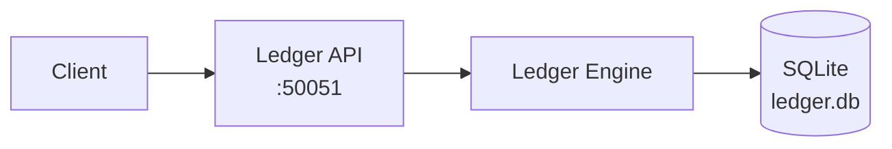
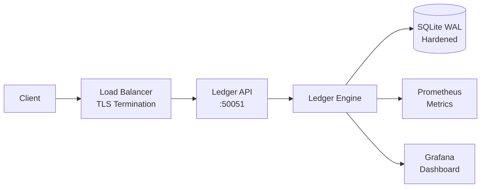
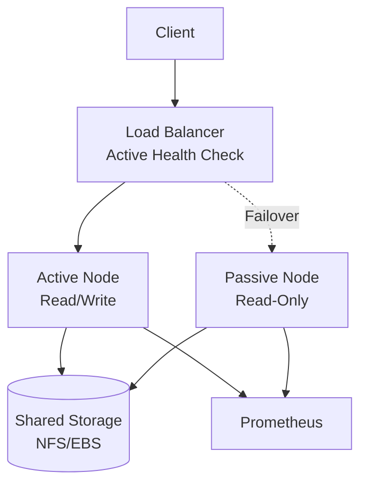
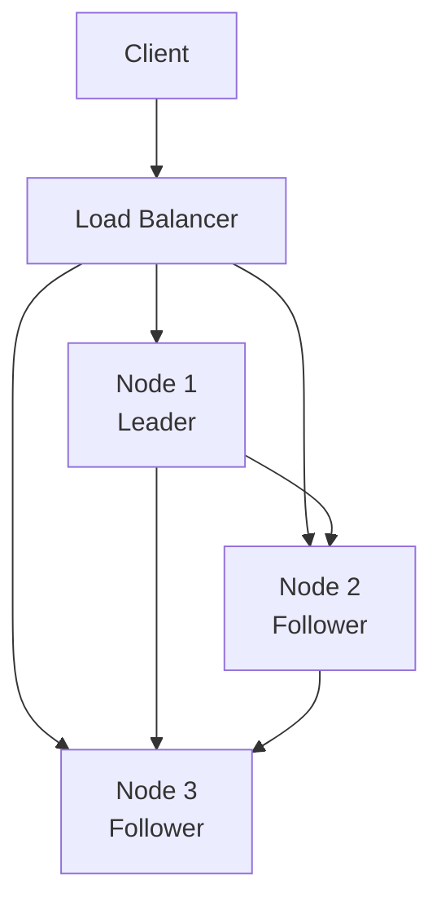

# VVU Earth Tech Ledger — Deployment Guide

## 1. Introduction

This guide covers deployment topologies, Docker deployment, Kubernetes deployment, systemd service configuration, TLS certificate management, monitoring setup, and scaling guidelines for the VVU Earth Tech Ledger.

## 2. Deployment Topologies

### 2.1 Single-Node (Development)



**Use case:** Development, testing, single-user applications

**Configuration:**
```toml
[database]
db_path = "ledger.db"

[network]
host = "127.0.0.1"
port = 50051
tls_enabled = false
```

### 2.2 Single-Node (Production)



**Use case:** Small production deployments, single-tenant applications

**Configuration:**
```toml
[database]
db_path = "/data/ledger.db"
journal_mode = "wal"
synchronous = "full"
secure_delete = true
trusted_schema = false

[network]
host = "0.0.0.0"
port = 50051
tls_enabled = true
mtls_enabled = true
cert_path = "/etc/ledger/certs/server.crt"
key_path = "/etc/ledger/certs/server.key"
ca_path = "/etc/ledger/certs/ca.crt"

[logging]
severity = "INFO"
json_logging = true

[metrics]
expose_prometheus = true
health_endpoint = "/health"
```

### 2.3 HA (Active-Passive)



**Use case:** High availability with automatic failover

**Considerations:**
- SQLite WAL mode is not safe for concurrent access from multiple processes
- Only one node can write at a time
- The passive node must detect active node failure and take over
- Shared storage must support file locking

### 2.4 Distributed (Future)



**Use case:** Multi-region, high-throughput, fault-tolerant deployments

**Note:** The replication protocol is not yet implemented. This topology is for future planning.

## 3. Docker Deployment

### 3.1 Dockerfile

```dockerfile
FROM python:3.12-slim

WORKDIR /app

# Install dependencies
COPY pyproject.toml .
RUN pip install --no-cache-dir .

# Copy application code
COPY src/ src/

# Create data directory
RUN mkdir -p /data

# Expose API port
EXPOSE 50051

# Health check
HEALTHCHECK --interval=30s --timeout=5s --retries=3 \
    CMD curl -f http://localhost:50051/health || exit 1

# Run the API server
ENTRYPOINT ["python", "-m", "production_ledger", "serve"]
CMD ["--host", "0.0.0.0", "--port", "50051"]
```

### 3.2 Docker Compose

```yaml
version: "3.8"

services:
  ledger:
    build: .
    ports:
      - "50051:50051"
    volumes:
      - ledger-data:/data
      - ledger-certs:/etc/ledger/certs:ro
    environment:
      - LEDGER_CONFIG=/etc/ledger/config.toml
    configs:
      - ledger-config
    restart: unless-stopped
    healthcheck:
      test: ["CMD", "curl", "-f", "http://localhost:50051/health"]
      interval: 30s
      timeout: 5s
      retries: 3

  prometheus:
    image: prom/prometheus:latest
    ports:
      - "9090:9090"
    volumes:
      - ./prometheus.yml:/etc/prometheus/prometheus.yml:ro
    restart: unless-stopped

  grafana:
    image: grafana/grafana:latest
    ports:
      - "3000:3000"
    volumes:
      - grafana-data:/var/lib/grafana
    restart: unless-stopped

volumes:
  ledger-data:
  ledger-certs:
  grafana-data:

configs:
  ledger-config:
    file: ./config.toml
```

### 3.3 Configuration File

```toml
[database]
db_path = "/data/ledger.db"
journal_mode = "wal"
synchronous = "full"
busy_timeout = 5000
cache_size = -64000
secure_delete = true
trusted_schema = false
foreign_keys = true

[crypto]
hash_algorithm = "sha256"
key_rotation_enabled = true
key_rotation_interval_days = 90

[validators]
max_validators = 256
min_quorum = 2
max_weight = 1000
key_expiry_days = 365

[network]
host = "0.0.0.0"
port = 50051
tls_enabled = true
mtls_enabled = true
cert_path = "/etc/ledger/certs/server.crt"
key_path = "/etc/ledger/certs/server.key"
ca_path = "/etc/ledger/certs/ca.crt"

[logging]
severity = "INFO"
json_logging = true

[metrics]
expose_prometheus = true
health_endpoint = "/health"
```

## 4. Kubernetes Deployment

### 4.1 Deployment Manifest

```yaml
apiVersion: apps/v1
kind: Deployment
metadata:
  name: ledger
  labels:
    app: ledger
spec:
  replicas: 1
  selector:
    matchLabels:
      app: ledger
  template:
    metadata:
      labels:
        app: ledger
    spec:
      containers:
        - name: ledger
          image: vvu/ledger:latest
          ports:
            - containerPort: 50051
          volumeMounts:
            - name: data
              mountPath: /data
            - name: certs
              mountPath: /etc/ledger/certs
              readOnly: true
          env:
            - name: LEDGER_CONFIG
              value: /etc/ledger/config.toml
          livenessProbe:
            httpGet:
              path: /health
              port: 50051
            initialDelaySeconds: 10
            periodSeconds: 30
          readinessProbe:
            httpGet:
              path: /health
              port: 50051
            initialDelaySeconds: 5
            periodSeconds: 10
          resources:
            requests:
              cpu: 500m
              memory: 512Mi
            limits:
              cpu: 2000m
              memory: 2Gi
      volumes:
        - name: data
          persistentVolumeClaim:
            claimName: ledger-data
        - name: certs
          secret:
            secretName: ledger-certs
```

### 4.2 Service Manifest

```yaml
apiVersion: v1
kind: Service
metadata:
  name: ledger
spec:
  selector:
    app: ledger
  ports:
    - port: 50051
      targetPort: 50051
  type: ClusterIP
```

### 4.3 PersistentVolumeClaim

```yaml
apiVersion: v1
kind: PersistentVolumeClaim
metadata:
  name: ledger-data
spec:
  accessModes:
    - ReadWriteOnce
  resources:
    requests:
      storage: 10Gi
  storageClassName: standard
```

### 4.4 Important Notes

- **Single replica only** — SQLite does not support concurrent writes from multiple pods
- **Persistent storage required** — The database must be on a persistent volume
- **No horizontal scaling** — The ledger is a single-writer system

## 5. Systemd Service

### 5.1 Service Unit File

```ini
[Unit]
Description=VVU Earth Tech Ledger
After=network.target

[Service]
Type=simple
User=ledger
Group=ledger
WorkingDirectory=/opt/ledger
ExecStart=/usr/bin/python -m production_ledger serve --config /etc/ledger/config.toml
Restart=on-failure
RestartSec=10
StandardOutput=journal
StandardError=journal

# Security hardening
NoNewPrivileges=true
ProtectSystem=strict
ProtectHome=true
ReadWritePaths=/data/ledger
PrivateTmp=true

# Resource limits
LimitNOFILE=65536
LimitNPROC=4096

[Install]
WantedBy=multi-user.target
```

### 5.2 Installation

```bash
sudo cp ledger.service /etc/systemd/system/
sudo systemctl daemon-reload
sudo systemctl enable ledger
sudo systemctl start ledger
```

### 5.3 Monitoring

```bash
# Check status
sudo systemctl status ledger

# View logs
sudo journalctl -u ledger -f

# Restart
sudo systemctl restart ledger
```

## 6. TLS Certificate Management

### 6.1 Certificate Generation

```bash
# Generate CA key and certificate
openssl genrsa -out ca.key 4096
openssl req -x509 -new -nodes -key ca.key -sha256 -days 3650 -out ca.crt

# Generate server key and CSR
openssl genrsa -out server.key 2048
openssl req -new -key server.key -out server.csr

# Sign server certificate
openssl x509 -req -in server.csr -CA ca.crt -CAkey ca.key -CAcreateserial \
    -out server.crt -days 365 -sha256

# Generate client key and CSR
openssl genrsa -out client.key 2048
openssl req -new -key client.key -out client.csr

# Sign client certificate
openssl x509 -req -in client.csr -CA ca.crt -CAkey ca.key -CAcreateserial \
    -out client.crt -days 365 -sha256
```

### 6.2 Certificate Rotation

1. Generate new server certificate
2. Update the certificate files on disk
3. Restart the ledger service (or implement hot-reload)
4. Verify the new certificate is active

### 6.3 Certificate Monitoring

- Monitor certificate expiry dates
- Set alerts for certificates expiring within 30 days
- Automate certificate rotation with a tool like certbot or Vault

## 7. Monitoring Setup

### 7.1 Prometheus Configuration

```yaml
scrape_configs:
  - job_name: 'ledger'
    scrape_interval: 15s
    static_configs:
      - targets: ['ledger:50051']
    metrics_path: /metrics
```

### 7.2 Grafana Dashboard

Recommended panels:

| Panel | Metric | Type |
|-------|--------|------|
| Ledger Sequence | `ledger_sequence` | Gauge |
| MMR Size | `ledger_mmr_size` | Gauge |
| Validator Count | `ledger_validator_count` | Gauge |
| Total Weight | `ledger_total_weight` | Gauge |
| Append Rate | `rate(ledger_appends_total[5m])` | Rate |
| Append Duration | `histogram_quantile(0.99, append_duration_seconds)` | Histogram |
| Replay Duration | `histogram_quantile(0.99, replay_duration_ms)` | Histogram |

### 7.3 Alert Rules

```yaml
groups:
  - name: ledger
    rules:
      - alert: LedgerUnhealthy
        expr: up{job="ledger"} == 0
        for: 1m
        labels:
          severity: critical
        annotations:
          summary: "Ledger is down"

      - alert: HighAppendLatency
        expr: histogram_quantile(0.99, rate(append_duration_seconds_bucket[5m])) > 1.0
        for: 5m
        labels:
          severity: warning
        annotations:
          summary: "Append latency is high"

      - alert: ValidatorCountLow
        expr: ledger_validator_count < 2
        for: 5m
        labels:
          severity: warning
        annotations:
          summary: "Validator count is below minimum quorum"
```

## 8. Scaling Guidelines

### 8.1 Vertical Scaling

| Parameter | Tuning | Effect |
|-----------|--------|--------|
| `cache_size` | Increase to -128000 (128 MiB) | Better read performance |
| `busy_timeout` | Increase to 10000 (10s) | Fewer write failures |
| `max_message_size` | Increase to 8 MiB | Larger payloads |
| CPU | 2+ cores | Better concurrent read performance |
| Memory | 2+ GiB | Larger cache, more entries in memory |

### 8.2 Performance Targets

| Metric | Target | Maximum |
|--------|--------|---------|
| Append latency (p99) | < 50ms | < 100ms |
| Read latency (p99) | < 10ms | < 50ms |
| Replay duration (1M entries) | < 5 minutes | < 10 minutes |
| Database size | < 10 GiB | < 50 GiB |

### 8.3 Capacity Planning

| Entries/Day | Database Growth/Month | Recommended Storage |
|-------------|----------------------|-------------------|
| 1,000 | ~30 MB | 10 GiB |
| 10,000 | ~300 MB | 50 GiB |
| 100,000 | ~3 GB | 100 GiB |
| 1,000,000 | ~30 GB | 500 GiB |

### 8.4 When to Scale

| Signal | Action |
|--------|--------|
| Append latency > 100ms | Increase `cache_size`, check disk I/O |
| Database size > 10 GiB | Consider VACUUM, archive old entries |
| WAL file > 100 MB | Run checkpoint more frequently |
| `DatabaseBusyError` frequent | Increase `busy_timeout`, reduce write contention |
| Replay duration > 10 minutes | Use `max_replay_entries` to limit scope |
