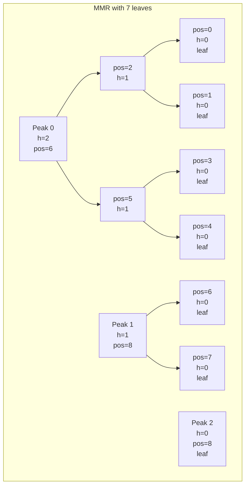

# VVU Earth Tech Ledger — Merkle Mountain Range Specification

## 1. Introduction

This document specifies the Merkle Mountain Range (MMR) implementation used in the VVU Earth Tech Ledger. The MMR is an append-only data structure that provides efficient inclusion proofs and consistency proofs, following the specification from the Grin project.

## 2. Data Structure

### 2.1 Overview

An MMR is a forest of perfect binary trees (mountains). Leaves are appended sequentially and the root is computed by *bagging* all peaks.



### 2.2 Position Numbering

Nodes are numbered in post-order traversal: a parent's position is always greater than its children's positions. For a leaf at index `i` (0-based), its position is:

```
leaf_pos(i) = 2 * i - popcount(i)
```

Where `popcount(i)` is the number of 1-bits in the binary representation of `i`.

### 2.3 Node Count

The total number of nodes in an MMR with `n` leaves is:

```
node_count(n) = 2 * n - popcount(n)
```

## 3. Peak Discovery Algorithm

### 3.1 Algorithm

Peaks are discovered by decomposing the leaf count into a sum of powers of 2 (from largest to smallest):

```
def peak_positions(size):
    if size <= 0:
        return []
    peaks = []
    offset = 0
    remaining = size
    while remaining > 0:
        h = floor(log2(remaining))
        mountain_leaves = 2^h
        peak_pos = offset + 2^(h+1) - 2
        peaks.append(peak_pos)
        offset += 2^(h+1) - 1
        remaining -= mountain_leaves
    return peaks
```

### 3.2 Examples

| Leaf Count | Decomposition | Peak Positions | Peak Heights |
|-----------|---------------|----------------|--------------|
| 1 | 1 | [0] | [0] |
| 2 | 2 | [2] | [1] |
| 3 | 2 + 1 | [2, 4] | [1, 0] |
| 4 | 4 | [6] | [2] |
| 5 | 4 + 1 | [6, 8] | [2, 0] |
| 6 | 4 + 2 | [6, 10] | [2, 1] |
| 7 | 4 + 2 + 1 | [6, 10, 12] | [2, 1, 0] |
| 8 | 8 | [14] | [3] |

## 4. Height Function

The height of a node at position `pos` is determined by:

```
def height(pos):
    n = pos + 1
    while True:
        h = floor(log2(n))
        mountain_size = 2^(h+1) - 1
        if mountain_size > n:
            h -= 1
            mountain_size = 2^(h+1) - 1
        if n == mountain_size:
            return h
        n -= mountain_size
```

A leaf has height 0. The height of a parent is always one greater than its children.

## 5. Bagging Order

The MMR root is computed by *bagging* the peaks. The bagging algorithm iteratively hashes peak pairs from right to left:

```
def bagging(peaks):
    if len(peaks) == 0:
        return domain_hash(VVU:MMR:BAG:1:, b"")
    if len(peaks) == 1:
        return peaks[0]
    acc = peaks[-1]
    for peak in reversed(peaks[:-1]):
        acc = domain_hash(VVU:MMR:BAG:1:, peak + acc)
    return acc
```

### 5.1 Bagging Domain

The bagging domain is `VVU:MMR:BAG:1:`. This is distinct from the internal MMR domain (`VVU:MMR:INT:1:`) to prevent collision between bagging hashes and internal node hashes.

### 5.2 Empty MMR

If the MMR has no leaves, the root is:

```
domain_hash(VVU:MMR:BAG:1:, b"")
```

### 5.3 Single Peak

If the MMR has a single peak (which happens when the leaf count is a power of 2), the root is the peak hash itself — no bagging is performed.

## 6. Node Hashing

### 6.1 Leaf Hash

```
hash_mmr_leaf(data) = domain_hash(VVU:MMR:INT:1:, 0x00 + data)
```

The leaf hash prepends the `LEAF_HASH_PREFIX` (0x00) byte before hashing with the MMR internal domain.

### 6.2 Branch Hash

```
hash_mmr_branch(left, right) = domain_hash(VVU:MMR:INT:1:, 0x01 + left + right)
```

The branch hash prepends the `BRANCH_HASH_PREFIX` (0x01) byte, then concatenates the left and right child hashes, and hashes with the MMR internal domain.

### 6.3 Prefix Bytes

The prefix bytes (0x00 for leaves, 0x01 for branches) prevent second preimage attacks where a branch hash could be interpreted as a leaf hash or vice versa.

## 7. Append Operation

### 7.1 Algorithm

When a leaf is appended:

1. Compute the leaf hash: `hash_mmr_leaf(leaf_hash)`
2. Store the leaf hash at the next available position
3. Compute the number of new parent nodes: `trailing_zeros(size)` where `size` is the new leaf count (1-indexed)
4. For each new parent node at position `pos + k` (k = 1, 2, ...):
   - Left child: `parent_pos - 2^k`
   - Right child: `parent_pos - 1`
   - Compute: `hash_mmr_branch(left_hash, right_hash)`

### 7.2 Example

Appending the 4th leaf (leaf index 3, size becomes 4):

```
Position 6 (new parent, h=2):
  left = position 2 (h=1)
  right = position 5 (h=1)
  hash = hash_mmr_branch(nodes[2], nodes[5])
```

Since 4 = 100 in binary, there are 2 trailing zeros, so 2 new parent nodes are created.

## 8. Inclusion Proof

### 8.1 Data Structure

```python
@dataclass(frozen=True)
class MMRProof:
    leaf_position: int
    leaf_hash: bytes
    path: list[tuple[int, bytes]]  # Sibling (position, hash) pairs from leaf to peak
    peaks: list[tuple[int, bytes]]  # All (position, hash) pairs for peaks
    mmr_size: int  # Number of leaves at proof time
```

### 8.2 Generation Algorithm

```
def inclusion_proof(leaf_pos):
    leaf_hash = nodes[leaf_pos]
    path = []
    current = leaf_pos
    while not is_peak(current):
        sibling = get_sibling(current)
        path.append((sibling, nodes[sibling]))
        current = get_parent(current)
    peaks = get_all_peaks()
    return MMRProof(leaf_pos, leaf_hash, path, peaks, size)
```

### 8.3 Verification Algorithm

```
def verify_inclusion(leaf_hash, proof, root):
    current_pos = proof.leaf_position
    current_hash = hash_mmr_leaf(leaf_hash)

    for sib_pos, sib_hash in proof.path:
        if is_right_child(current_pos):
            current_hash = hash_mmr_branch(sib_hash, current_hash)
        else:
            current_hash = hash_mmr_branch(current_hash, sib_hash)
        current_pos = get_parent(current_pos)

    # Verify current_hash matches the corresponding peak
    peak_match = any(pos == current_pos and hash == current_hash
                     for pos, hash in proof.peaks)
    if not peak_match:
        return False

    # Verify the bagged root
    peak_hashes = [h for _, h in proof.peaks]
    computed_root = bagging(peak_hashes)
    return computed_root == root
```

### 8.4 Verification Steps

1. **Leaf hash computation**: `hash_mmr_leaf(leaf_hash)`
2. **Path traversal**: Walk from leaf to peak, combining sibling hashes
3. **Peak verification**: The computed peak must match one of the proof's peaks
4. **Root verification**: The bagged root of all peaks must match the expected root

## 9. Consistency Proof

### 9.1 Data Structure

```python
@dataclass(frozen=True)
class MMRConsistencyProof:
    earlier_size: int
    later_size: int
    earlier_peaks: list[tuple[int, bytes]]
    later_peaks: list[tuple[int, bytes]]
    proof_hashes: list[bytes]  # Additional hashes needed
```

### 9.2 Generation Algorithm

```
def consistency_proof(earlier_size):
    earlier_peaks = get_peaks_at_size(earlier_size)
    later_peaks = get_peaks_at_size(current_size)

    proof_hashes = []
    for ep_pos, _ in earlier_peaks:
        if ep_pos in later_peak_positions:
            continue  # Peak unchanged
        # Walk up from earlier peak to nearest later peak
        current = ep_pos
        while current not in later_peak_positions:
            sibling = get_sibling(current)
            proof_hashes.append(nodes[sibling])
            current = get_parent(current)

    return MMRConsistencyProof(
        earlier_size, current_size,
        earlier_peaks, later_peaks, proof_hashes
    )
```

### 9.3 Verification Algorithm

```
def verify_consistency(earlier_root, later_root, proof):
    # Step 1: Verify earlier_root from earlier_peaks
    earlier_peak_hashes = [h for _, h in proof.earlier_peaks]
    computed_earlier = bagging(earlier_peak_hashes)
    if computed_earlier != earlier_root:
        return False

    # Step 2: Verify later_root from later_peaks
    later_peak_hashes = [h for _, h in proof.later_peaks]
    computed_later = bagging(later_peak_hashes)
    if computed_later != later_root:
        return False

    # Step 3: Verify that earlier peaks are consistent with later peaks
    known = dict(earlier_peaks)
    proof_idx = 0
    for ep_pos, ep_hash in proof.earlier_peaks:
        if ep_pos in later_peak_map:
            continue
        current_pos = ep_pos
        current_hash = ep_hash
        while current_pos not in later_peak_map:
            sibling_hash = get_from_known_or_proof(current_pos)
            if is_right_child(current_pos):
                parent_hash = hash_mmr_branch(sibling_hash, current_hash)
            else:
                parent_hash = hash_mmr_branch(current_hash, sibling_hash)
            parent_pos = get_parent(current_pos)
            known[parent_pos] = parent_hash
            current_pos = parent_pos
            current_hash = parent_hash
        if current_hash != later_peak_map[current_pos]:
            return False

    return True
```

## 10. Index Computation

### 10.1 Leaf Position from Index

```
leaf_pos(index) = 2 * index - popcount(index)
```

### 10.2 Leaf Index from Position

```
leaf_index(pos) = binary search for largest i such that leaf_pos(i) < pos
```

### 10.3 Node Count

```
node_count(n) = 2 * n - popcount(n)
```

### 10.4 Sibling Position

```
if is_right_child(pos):
    sibling = pos - (2^(h+1) - 1)
else:
    sibling = pos + (2^(h+1) - 1)
```

### 10.5 Parent Position

```
if is_right_child(pos):
    parent = pos + 1
else:
    parent = pos + 2^(h+1)
```

### 10.6 Is Right Child

```
is_right_child(pos) = height(pos + 1) > height(pos)
```

## 11. Storage Format

### 11.1 In-Memory Format

The MMR is stored in memory as a dictionary mapping positions to hashes:

```python
class MerkleMountainRange:
    _size: int  # number of leaves
    _nodes: dict[int, bytes]  # position → hash
```

### 11.2 Database Format

The MMR is persisted in the `mmr_nodes` table:

```sql
CREATE TABLE IF NOT EXISTS mmr_nodes (
    position INTEGER PRIMARY KEY,
    hash     BLOB NOT NULL
);
```

### 11.3 Serialization Format

The MMR can be serialized to a dictionary for JSON or canonical encoding:

```python
{
    "size": 7,
    "nodes": {
        "0": "a1b2c3...",  # hex-encoded hash
        "1": "d4e5f6...",
        "2": "7a8b9c...",
        ...
    }
}
```

## 12. Test Vectors

### 12.1 Single Leaf

```
Input:  leaf_hash = 0xAAAAAAAA... (32 bytes)
Output:
  size = 1
  nodes = {0: hash_mmr_leaf(0xAAAAAAAA...)}
  root = hash_mmr_leaf(0xAAAAAAAA...)
  peaks = [(0, hash_mmr_leaf(0xAAAAAAAA...))]
```

### 12.2 Two Leaves

```
Input:  leaf_hash_0 = 0xAAAAAAAA..., leaf_hash_1 = 0xBBBBBBBB...
Output:
  size = 2
  nodes = {
    0: hash_mmr_leaf(0xAAAAAAAA...),
    1: hash_mmr_leaf(0xBBBBBBBB...),
    2: hash_mmr_branch(nodes[0], nodes[1])
  }
  root = nodes[2]  # single peak
  peaks = [(2, nodes[2])]
```

### 12.3 Three Leaves

```
Input:  leaf_hash_0, leaf_hash_1, leaf_hash_2
Output:
  size = 3
  peaks = [(2, nodes[2]), (4, hash_mmr_leaf(leaf_hash_2))]
  root = domain_hash(VVU:MMR:BAG:1:, nodes[2] + hash_mmr_leaf(leaf_hash_2))
```

### 12.4 Inclusion Proof for Leaf 0 in 3-leaf MMR

```
leaf_position = 0
path = [(1, nodes[1])]  # sibling of leaf 0
peaks = [(2, nodes[2]), (4, nodes[4])]

Verification:
  current = hash_mmr_leaf(leaf_hash_0)
  current = hash_mmr_branch(current, nodes[1])  # nodes[2]
  # current matches peak at position 2
  # bagging(nodes[2], nodes[4]) == root
```

## 13. Complexity Analysis

| Operation | Time Complexity | Space Complexity |
|-----------|-----------------|------------------|
| Append | O(log n) | O(log n) amortized |
| Get Root | O(log n) | O(1) |
| Inclusion Proof | O(log n) | O(log n) |
| Verify Inclusion | O(log n) | O(1) |
| Consistency Proof | O(log n) | O(log n) |
| Verify Consistency | O(log n) | O(1) |
| Get Peaks | O(log n) | O(log n) |

Where `n` is the number of leaves and `log n` is the height of the tallest mountain.
