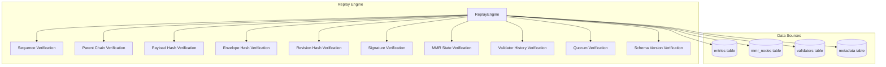

# VVU Earth Tech Ledger — Replay Specification

## 1. Introduction

The Replay Engine is a critical component of the VVU Earth Tech Ledger that reconstructs and verifies the entire ledger from genesis (or a given starting sequence). It checks every integrity property that should hold for a correctly constructed ledger, producing a `ReplayViolation` for each check that fails.

## 2. Purpose

The replay engine serves three purposes:

1. **Integrity verification** — confirm that the ledger has not been tampered with
2. **Audit** — provide an independent, reproducible verification of the entire ledger
3. **Recovery** — verify that a restored backup or snapshot is consistent

## 3. Replay Architecture



## 4. Verification Checks

### 4.1 Check 1: Sequence Continuity

**Property:** Every entry must have a sequence number that is exactly one greater than the previous entry.

**Algorithm:**
```
for each entry in sequence order:
    if entry.sequence != expected_sequence:
        violation(sequence=expected_sequence, check="sequence_continuity",
                  expected=expected_sequence, actual=entry.sequence)
    expected_sequence += 1
```

**Failure severity:** ERROR

**Rationale:** A gap in sequence numbers indicates missing entries; a duplicate indicates a double-append.

### 4.2 Check 2: Parent Chain Integrity

**Property:** Each entry's `parent_hash` must equal the previous entry's `envelope_hash`. The first entry must have `parent_hash == GENESIS_HASH` (32 zero bytes).

**Algorithm:**
```
for first entry:
    if entry.parent_hash != GENESIS_HASH:
        violation(sequence=0, check="parent_chain",
                  expected=GENESIS_HASH, actual=entry.parent_hash)

for each subsequent entry:
    if entry.parent_hash != previous_entry.envelope_hash:
        violation(sequence=entry.sequence, check="parent_chain",
                  expected=previous_entry.envelope_hash, actual=entry.parent_hash)
```

**Failure severity:** ERROR

**Rationale:** The parent chain is the fundamental integrity mechanism of the ledger. A broken parent chain indicates tampering or data corruption.

### 4.3 Check 3: Payload Hash Correctness

**Property:** Each entry's `payload_hash` must equal `hash_payload(entry.payload)`.

**Algorithm:**
```
computed = hash_payload(entry.payload)
if computed != entry.payload_hash:
    violation(sequence=entry.sequence, check="payload_hash",
              expected=entry.payload_hash, actual=computed)
```

**Failure severity:** ERROR

**Rationale:** The payload hash is the root of trust for the entry's data. If it doesn't match, the payload has been modified.

### 4.4 Check 4: Envelope Hash Correctness

**Property:** Each entry's `envelope_hash` must equal `hash_envelope(pre_image)` where `pre_image` is the canonical encoding of `{sequence, parent_hash, payload_hash, timestamp}`.

**Algorithm:**
```
pre_image = canonical_encode({
    "sequence": entry.sequence,
    "parent_hash": entry.parent_hash,
    "payload_hash": entry.payload_hash,
    "timestamp": struct.pack(">d", entry.timestamp)
})
computed = hash_envelope(pre_image)
if computed != entry.envelope_hash:
    violation(sequence=entry.sequence, check="envelope_hash",
              expected=entry.envelope_hash, actual=computed)
```

**Failure severity:** ERROR

**Rationale:** The envelope hash links the entry's metadata to the hash chain. If it doesn't match, the metadata has been tampered with.

### 4.5 Check 5: Revision Hash Correctness

**Property:** Each entry's `revision_hash` must equal `hash_revision(payload_hash + envelope_hash)`.

**Algorithm:**
```
computed = hash_revision(entry.payload_hash + entry.envelope_hash)
if computed != entry.revision_hash:
    violation(sequence=entry.sequence, check="revision_hash",
              expected=entry.revision_hash, actual=computed)
```

**Failure severity:** ERROR

**Rationale:** The revision hash is the composite integrity value that is signed. If it doesn't match, either the payload hash or envelope hash is incorrect.

### 4.6 Check 6: Signature Validity

**Property:** Each entry's signature must be a valid 64-byte Ed25519 signature.

**Algorithm (current — structural check):**
```
if len(entry.signature.signature) != 64:
    violation(sequence=entry.sequence, check="signature",
              expected="64-byte signature", actual=f"{len(sig)}-byte signature")
```

**Algorithm (full — with public key):**
```
try:
    signer.verify(DOMAIN_REVISION, entry.revision_hash, entry.signature)
except InvalidSignatureError:
    violation(sequence=entry.sequence, check="signature",
              expected="valid signature", actual="invalid signature")
```

**Failure severity:** ERROR (structural), WARNING (verification failure without public key)

**Rationale:** The signature provides non-repudiation. A structural check ensures the signature is well-formed; a full verification requires the public key.

### 4.7 Check 7: MMR State Verification

**Property:** The MMR root computed by rebuilding from entries must match the stored MMR root.

**Algorithm:**
```
rebuilt_mmr = MerkleMountainRange()
for entry in entries:
    rebuilt_mmr.append(entry.envelope_hash)
rebuilt_root = rebuilt_mmr.get_root()

# Compare with stored MMR root
mmr_nodes = storage.fetch_all("SELECT position, hash FROM mmr_nodes ORDER BY position")
if rebuilt_mmr.size != len(entries):
    violation(sequence=last_sequence, check="mmr_root",
              expected="match", actual="mismatch")
```

**Failure severity:** ERROR

**Rationale:** The MMR root is a compact commitment to the entire ledger. If the rebuilt root doesn't match, entries have been added, removed, or modified.

### 4.8 Check 8: Validator History Verification

**Property:** All signing keys referenced in entries must exist in the validator registry, and the validator must have been active at the time of signing.

**Algorithm:**
```
for entry in entries:
    validator = validator_map.get(entry.signature.key_id)
    if validator is None:
        violation(sequence=entry.sequence, check="validator_history",
                  expected="validator registered", actual="not found")
        continue

    if validator.registration_sequence > entry.sequence:
        violation(sequence=entry.sequence, check="validator_history",
                  expected="registration_sequence <= entry.sequence",
                  actual=f"registration_sequence = {validator.registration_sequence}")

    if validator.revocation_sequence is not None and validator.revocation_sequence <= entry.sequence:
        violation(sequence=entry.sequence, check="validator_history",
                  expected="revocation_sequence > entry.sequence or None",
                  actual=f"revocation_sequence = {validator.revocation_sequence}")
```

**Failure severity:** WARNING (if validator not found), ERROR (if validator was not active)

**Rationale:** A validator must be active at the time of signing. If a validator was not yet registered or was already revoked, the signature is invalid.

### 4.9 Check 9: Quorum Verification

**Property:** If quorum verification is enabled, the set of signatures on each entry must achieve the quorum threshold.

**Algorithm:**
```
if config.replay.verify_quorum:
    result = quorum_verifier.check_quorum([entry.signature])
    if not result.achieved:
        violation(sequence=entry.sequence, check="quorum",
                  expected="quorum achieved", actual="quorum not achieved")
```

**Failure severity:** WARNING

**Rationale:** Quorum verification is a higher-level check that may not apply to all deployment topologies.

### 4.10 Check 10: Schema Version Verification

**Property:** The database schema version must be at least 1.

**Algorithm:**
```
schema_version = storage.get_schema_version()
if schema_version < 1:
    violation(sequence=0, check="schema_version",
              expected=">= 1", actual=str(schema_version))
```

**Failure severity:** WARNING

**Rationale:** The schema version indicates whether migrations have been applied. A version of 0 means the database was not properly initialized.

## 5. Genesis Reconstruction

The replay engine reconstructs the ledger from genesis by:

1. Loading all entries from the `entries` table in sequence order
2. Starting with `previous_envelope = None` (first entry has `parent_hash = GENESIS_HASH`)
3. For each entry, verifying all checks listed above
4. Building the MMR by appending each entry's `envelope_hash`
5. Comparing the rebuilt MMR root with the stored root

### Genesis Hash

The genesis hash is `b"\x00" * 32` — 32 zero bytes. The first entry in the ledger must have `parent_hash` equal to this value.

## 6. Formal Verification Properties

### 6.1 Determinism

**Property:** Given the same sequence of entries, the replay engine produces identical results.

**Proof sketch:**
- All hash functions are deterministic (SHA-256 with domain separation)
- Canonical encoding is deterministic (sorted keys, minimal integer encoding)
- Ed25519 signatures are deterministic (RFC 8032)
- The replay algorithm processes entries in strict sequence order

### 6.2 Completeness

**Property:** If the ledger is correctly constructed, the replay engine produces zero violations.

**Proof sketch:**
- Correct entries have correct hashes by construction
- The parent chain is correct by construction (each entry's `parent_hash` is set to the previous entry's `envelope_hash`)
- The MMR is rebuilt from the same entries
- The validator registry is consistent with the entries

### 6.3 Soundness

**Property:** If the replay engine produces zero violations, the ledger is correctly constructed.

**Proof sketch:**
- Each check verifies a specific integrity property
- The hash chain is verified end-to-end (parent → envelope → revision)
- The MMR root is verified against the stored root
- The validator history is verified against the registry

### 6.4 Tamper Detection

**Property:** Any modification to the ledger is detected by the replay engine.

**Arguments:**
- **Entry modification**: breaks `payload_hash`, `envelope_hash`, or `revision_hash`
- **Entry insertion**: breaks `sequence_continuity` and `parent_chain`
- **Entry deletion**: breaks `sequence_continuity` and `parent_chain`
- **Entry reordering**: breaks `sequence_continuity` and `parent_chain`
- **Signature modification**: breaks `signature` check
- **MMR modification**: breaks `mmr_root` check

## 7. Replay Attack Mitigations

### 7.1 Cross-Domain Signature Replay

**Attack:** An attacker takes a signature produced under `DOMAIN_REVISION` and attempts to use it under `DOMAIN_PAYLOAD`.

**Mitigation:** Domain separation. The signature is computed over:

```
prehash = SHA-256(domain ‖ len(domain)₄ ‖ revision_hash)
signature = Ed25519.sign(prehash)
```

Changing the domain prefix changes the prehash, making the signature invalid under a different domain.

### 7.2 Cross-Ledger Entry Replay

**Attack:** An attacker takes an entry from one ledger and attempts to replay it on another.

**Mitigation:** The `parent_hash` in the envelope pre-image is specific to the target ledger. Since the parent hash is different, the envelope hash is different, and the signature is invalid.

### 7.3 Timestamp Manipulation

**Attack:** An attacker modifies the timestamp in an entry.

**Mitigation:** The timestamp is part of the envelope pre-image (encoded as 8-byte big-endian IEEE 754 double). Changing the timestamp changes the envelope hash, which breaks the hash chain.

### 7.4 Key Revocation Bypass

**Attack:** An attacker uses a revoked key to sign an entry.

**Mitigation:** The validator history verification checks that the signing key was not revoked at the time of signing. If `revocation_sequence <= entry.sequence`, a violation is reported.

## 8. Replay Configuration

The replay engine's behavior is controlled by `ReplayConfig`:

| Parameter | Default | Description |
|-----------|---------|-------------|
| `verify_sequence` | True | Verify sequence continuity |
| `verify_parent_chain` | True | Verify parent chain integrity |
| `verify_payload_hash` | True | Verify payload hash correctness |
| `verify_envelope_hash` | True | Verify envelope hash correctness |
| `verify_revision_hash` | True | Verify revision hash correctness |
| `verify_mmr` | True | Verify MMR state |
| `verify_validator_history` | True | Verify validator history |
| `verify_quorum` | True | Verify quorum for each entry |
| `verify_snapshots` | True | Verify snapshot integrity |
| `verify_proofs` | True | Verify proof correctness |
| `verify_schema_versions` | True | Verify schema version |
| `max_replay_entries` | 1,000,000 | Maximum entries to replay |

## 9. Replay Output

### 9.1 ReplayViolation

Each violation is recorded as a `ReplayViolation`:

| Field | Type | Description |
|-------|------|-------------|
| `sequence` | int | Sequence number where the violation was found |
| `check` | str | Name of the check that failed |
| `expected` | str | Expected value (as string) |
| `actual` | str | Actual value (as string) |
| `severity` | str | "error" or "warning" |

### 9.2 ReplayResult

The final result is a `ReplayResult`:

| Field | Type | Description |
|-------|------|-------------|
| `success` | bool | Whether the replay completed without errors |
| `total_entries` | int | Total number of entries in the ledger |
| `verified_entries` | int | Number of entries successfully verified |
| `violations` | list[ReplayViolation] | All violations found |
| `duration_ms` | float | Wall-clock duration in milliseconds |
| `mmr_root` | bytes | The MMR root computed during replay |

### 9.3 Severity Levels

| Severity | Meaning | Action Required |
|----------|---------|-----------------|
| ERROR | Integrity violation detected | Immediate investigation required |
| WARNING | Potential issue detected | Review and assess |

## 10. Performance Characteristics

| Entry Count | Expected Duration | Memory Usage |
|-------------|-------------------|--------------|
| 1,000 | < 1 second | < 10 MB |
| 10,000 | < 5 seconds | < 50 MB |
| 100,000 | < 30 seconds | < 200 MB |
| 1,000,000 | < 5 minutes | < 1 GB |

The replay engine loads all entries into memory and rebuilds the MMR. For very large ledgers, the `max_replay_entries` configuration parameter can be used to limit the scope of the replay.

## 11. Schema Evolution Checks

During replay, the engine checks that the schema version is compatible:

1. **Schema version >= 1**: The core tables (entries, validators, snapshots, mmr_nodes) must exist
2. **Schema version >= 2**: The audit_log table and indexes must exist
3. **Schema version >= 3**: The payload and key_version columns must exist in the entries table

If a schema version check fails, a WARNING is reported. The replay can still proceed with the data available, but some checks may be incomplete.
