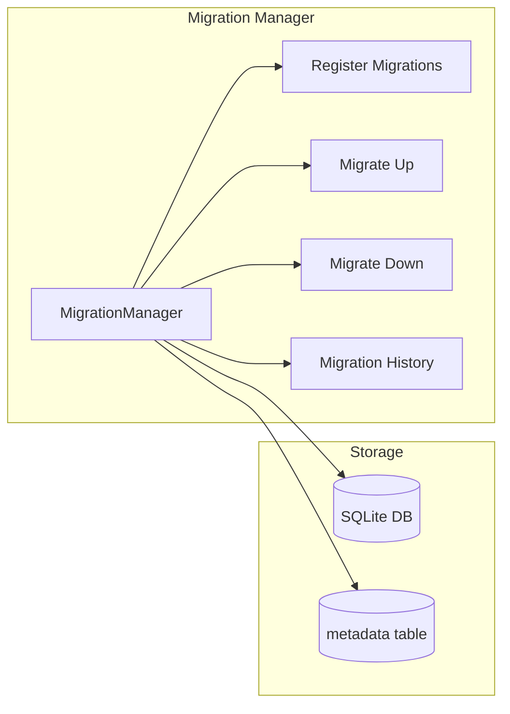
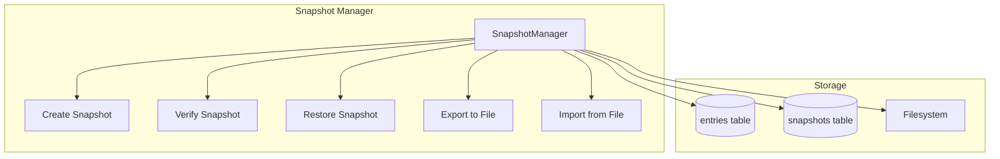
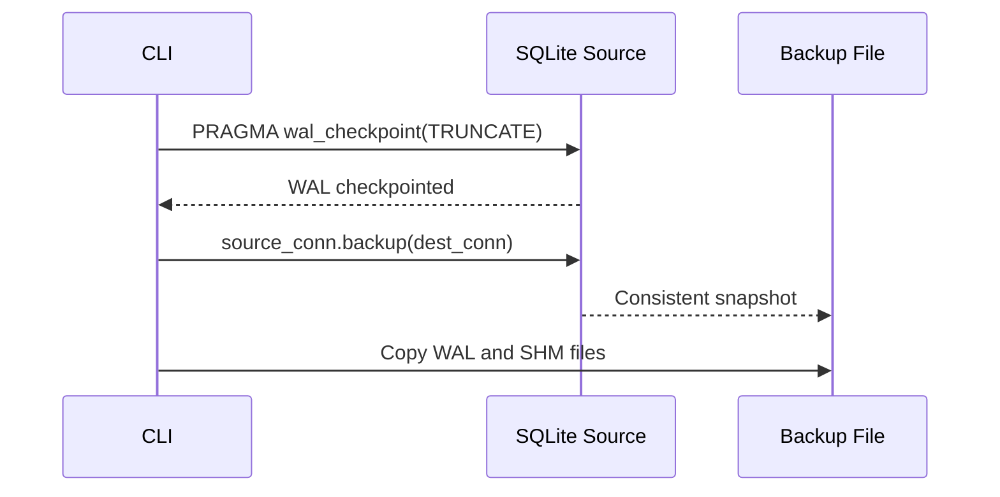
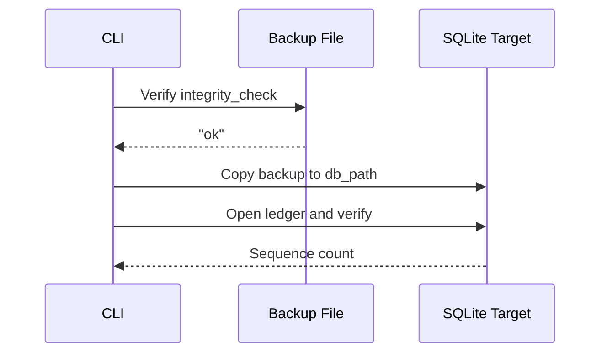
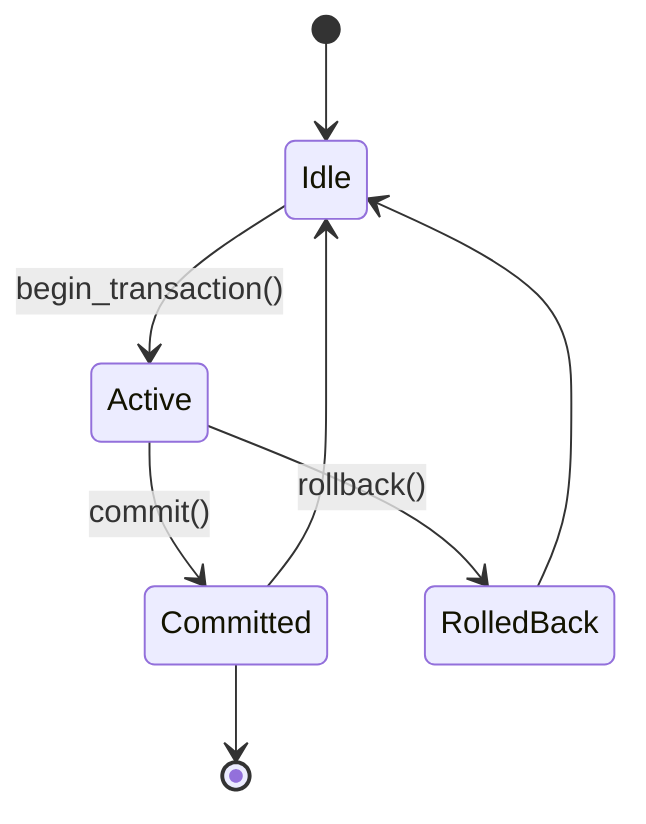

# VVU Earth Tech Ledger — Storage Model

## 1. Introduction

This document specifies the storage model for the VVU Earth Tech Ledger, including SQLite hardening, migrations, snapshots, integrity verification, backup/restore, database size management, and corruption recovery.

## 2. SQLite Hardening

### 2.1 PRAGMA Configuration

The ledger applies production-grade PRAGMAs on every connection to ensure data integrity, crash safety, and consistent behavior.

| PRAGMA | Value | Rationale |
|--------|-------|-----------|
| `journal_mode` | WAL | Concurrent readers + single writer; no blocking reads |
| `synchronous` | FULL | Every commit fsyncs to disk; maximum durability |
| `busy_timeout` | 5000 | Wait up to 5 seconds instead of raising immediately |
| `cache_size` | -64000 | 64 MiB absolute cache limit (negative = KiB) |
| `page_size` | 4096 | Standard page size; optimal for most SSDs |
| `secure_delete` | ON | Zero-fill deleted pages on VACUUM |
| `trusted_schema` | OFF | Reject dangerous SQL functions in triggers/views |
| `foreign_keys` | ON | Enforce referential integrity |
| `temp_store` | MEMORY | Temporary tables live in RAM only |
| `locking_mode` | NORMAL | Allow other connections to read/write |

### 2.2 WAL Mode

Write-Ahead Logging (WAL) mode provides:

- **Concurrent reads** — Readers don't block writers and vice versa
- **Atomic commits** — All changes in a transaction are committed or none
- **Fast reads** — Readers access the WAL file for recent changes
- **Checkpointing** — The WAL is periodically checkpointed to the main database

### 2.3 Synchronous=FULL

With `synchronous=FULL`, SQLite:

- Calls `fsync()` after every commit
- Ensures that committed data is on disk before returning
- Provides maximum durability at the cost of write performance

### 2.4 Secure Delete

With `secure_delete=ON`:

- Deleted data is zero-filled before the page is freed
- Prevents forensic recovery of deleted data
- Applies during VACUUM operations

### 2.5 Trusted Schema=OFF

With `trusted_schema=OFF`:

- Application-defined SQL functions in triggers and views are rejected
- Prevents privilege escalation through SQL injection in schema objects
- Critical for production security

## 3. Database Schema

### 3.1 Schema Versioning

The schema version is tracked in the `metadata` table:

```sql
CREATE TABLE IF NOT EXISTS metadata (
    key   TEXT PRIMARY KEY,
    value TEXT NOT NULL
);
```

The current schema version is stored as `('schema_version', '3')`.

### 3.2 Schema Evolution

| Version | Description | Key Changes |
|---------|-------------|-------------|
| 1 | Core tables | entries, validators, snapshots, mmr_nodes, metadata |
| 2 | Audit and indexing | audit_log table, indexes on entries/validators/audit_log |
| 3 | Payload and key version | payload column, key_version column in entries |

## 4. Migrations

### 4.1 Migration Framework



### 4.2 Migration Data Structure

```python
@dataclass(frozen=True)
class Migration:
    version: int
    description: str
    up_sql: str
    down_sql: str
```

### 4.3 Migration Process

1. **Check current version** — Read `schema_version` from metadata
2. **Find pending migrations** — Migrations with `version > current_version`
3. **Apply in order** — Each migration runs in its own transaction
4. **Update version** — Set `schema_version` to the new version
5. **Rollback on failure** — If a migration fails, the transaction is rolled back

### 4.4 Forward Migration

```python
def migrate_up(target_version=None):
    pending = get_pending_migrations()
    if target_version is not None:
        pending = [m for m in pending if m.version <= target_version]
    for migration in pending:
        storage.begin_transaction()
        storage.execute_script(migration.up_sql)
        storage.execute("INSERT OR REPLACE INTO metadata VALUES ('schema_version', ?)",
                        (str(migration.version),))
        storage.commit()
```

### 4.5 Rollback Migration

```python
def migrate_down(target_version):
    to_rollback = sorted(
        [m for m in migrations if target_version < m.version <= current],
        key=lambda m: m.version, reverse=True
    )
    for migration in to_rollback:
        storage.begin_transaction()
        storage.execute_script(migration.down_sql)
        storage.execute("INSERT OR REPLACE INTO metadata VALUES ('schema_version', ?)",
                        (str(migration.version - 1),))
        storage.commit()
```

## 5. Snapshots

### 5.1 Snapshot Architecture



### 5.2 Snapshot Data Structure

```python
@dataclass(frozen=True)
class Snapshot:
    id: int           # Database row ID
    sequence: int     # Ledger sequence at snapshot time
    mmr_root: bytes   # MMR root hash
    data: bytes       # Canonical-encoded snapshot payload
    created_at: float # Creation timestamp
    hash: bytes       # Domain-separated integrity hash
```

### 5.3 Snapshot Creation

1. Collect all entries from the `entries` table
2. Encode timestamps as 8-byte big-endian IEEE 754 doubles
3. Build the snapshot payload: `{sequence, mmr_root, entries, mmr_data}`
4. Serialize using the canonical serializer
5. Compute the integrity hash: `hash_snapshot(data)`
6. Store in the `snapshots` table

### 5.4 Snapshot File Format

```
Magic (8 bytes): b"VVUSNAP\x01"
Data length (4 bytes, big-endian uint32)
Data (variable length)
```

### 5.5 Snapshot Integrity

Snapshot integrity is verified by:

1. Loading the snapshot data from the database or file
2. Computing `hash_snapshot(data)` using the `VVU:SNAP:1:` domain
3. Comparing the computed hash with the stored hash
4. If they don't match, raising `SnapshotIntegrityError`

## 6. Integrity Verification

### 6.1 Database Integrity Check

```python
def check_integrity() -> bool:
    result = storage.fetch_one("PRAGMA integrity_check")
    return result is not None and result[0] == "ok"
```

This is run automatically on database close.

### 6.2 Schema Version Check

```python
def get_schema_version() -> int:
    row = storage.fetch_one("SELECT name FROM sqlite_master WHERE type='table' AND name='metadata'")
    if row is None:
        return 0
    row = storage.fetch_one("SELECT value FROM metadata WHERE key='schema_version'")
    return int(row[0]) if row else 0
```

### 6.3 Database Statistics

```python
def get_stats() -> dict:
    return {
        "page_count": ...,
        "page_size": ...,
        "free_pages": ...,
        "journal_mode": ...,
        "synchronous": ...,
        "cache_size": ...,
        "busy_timeout": ...,
        "db_path": ...,
    }
```

## 7. Backup and Restore

### 7.1 Backup Process



### 7.2 Restore Process



### 7.3 Backup Verification

Before restoring a backup, the CLI:

1. Opens the backup file as a SQLite database
2. Runs `PRAGMA integrity_check`
3. Verifies the result is "ok"
4. Copies the backup file to the target location
5. Opens the ledger and verifies the sequence count

## 8. Database Size Management

### 8.1 Size Estimation

The database size depends on:

- **Page count**: Number of pages in the database
- **Page size**: 4096 bytes (default)
- **Free pages**: Pages that have been freed but not reclaimed

Estimated size = `(page_count - free_pages) * page_size`

### 8.2 VACUUM

The VACUUM command compacts the database by:

- Rebuilding the database file
- Removing free pages
- Defragmenting the database
- Applying `secure_delete` (zero-filling deleted data)

```python
def vacuum():
    storage.execute("VACUUM")
```

### 8.3 WAL Checkpoint

The WAL checkpoint transfers data from the WAL file to the main database:

```python
def checkpoint():
    storage.execute("PRAGMA wal_checkpoint(TRUNCATE)")
```

TRUNCATE mode ensures the WAL file is fully checkpointed and truncated.

### 8.4 Size Management Recommendations

| Action | Frequency | Impact |
|--------|-----------|--------|
| WAL checkpoint | Every 10,000 entries | Keeps WAL file small |
| VACUUM | Monthly or after large deletions | Reclaims disk space |
| Integrity check | Daily | Detects corruption early |
| Backup | Daily | Disaster recovery |

## 9. Corruption Recovery

### 9.1 Detection

Corruption is detected by:

1. **Integrity check on close** — `PRAGMA integrity_check` is run automatically
2. **Replay verification** — The replay engine detects tampering
3. **Hash mismatch** — Any hash computation that doesn't match the stored value
4. **DatabaseCorruptError** — Raised when the integrity check fails

### 9.2 Recovery Strategies

| Strategy | When to Use | Data Loss Risk |
|----------|-------------|----------------|
| **Restore from backup** | Database is corrupted | None (if backup is recent) |
| **Restore from snapshot** | Specific entries are corrupted | None (snapshot is point-in-time) |
| **Replay from genesis** | Verification needed after restore | None (replay verifies all entries) |
| **Re-initialize** | Database is completely lost | ALL data lost |

### 9.3 Recovery Procedure

1. **Identify the corruption** — Run `PRAGMA integrity_check` and replay verification
2. **Locate the latest valid backup** — Check backup timestamps
3. **Restore the backup** — Copy the backup to the database location
4. **Verify the restoration** — Run replay verification
5. **Re-append missing entries** — If the backup is not the latest, re-append entries from the replication log
6. **Create a new snapshot** — After verification, create a new snapshot

### 9.4 WAL Recovery

If the WAL file is corrupted:

1. **Attempt checkpoint** — `PRAGMA wal_checkpoint(TRUNCATE)`
2. **If checkpoint fails** — Delete the WAL and SHM files
3. **Verify integrity** — Run `PRAGMA integrity_check`
4. **Replay verification** — Ensure the hash chain is intact

Note: Deleting the WAL file may result in the loss of the most recent transactions that were not yet checkpointed.

## 10. Transaction Management

### 10.1 Transaction Lifecycle



### 10.2 Context Manager

The `LedgerStorage` class supports context manager usage:

```python
with LedgerStorage(config) as storage:
    storage.execute("INSERT INTO entries ...")
    # Auto-commits on success, auto-rolls back on exception
```

### 10.3 Transaction Isolation

With WAL mode and `synchronous=FULL`:

- **Readers** see a consistent snapshot of the database
- **Writers** serialize access through the WAL
- **Busy timeout** prevents immediate failure on lock contention

## 11. Performance Tuning

### 11.1 Write Performance

| Parameter | Value | Effect |
|-----------|-------|--------|
| `synchronous` | FULL | Slowest writes, maximum durability |
| `journal_mode` | WAL | Concurrent reads during writes |
| `cache_size` | -64000 | 64 MiB cache reduces disk I/O |
| `busy_timeout` | 5000 | 5-second wait for locked database |

### 11.2 Read Performance

| Parameter | Value | Effect |
|-----------|-------|--------|
| `cache_size` | -64000 | Large cache improves repeated reads |
| `page_size` | 4096 | Standard page size for SSDs |
| Indexes | On sequence, payload_hash, key_id | Fast lookups |

### 11.3 Bulk Operations

For bulk operations (e.g., replay verification):

- Use `execute_many()` for batch inserts
- Increase `cache_size` for large datasets
- Consider temporary `synchronous=NORMAL` for bulk imports (not recommended for production)

## 12. Monitoring

### 12.1 Database Metrics

| Metric | Source | Description |
|--------|--------|-------------|
| `page_count` | `PRAGMA page_count` | Total pages in the database |
| `free_pages` | `PRAGMA freelist_count` | Free pages available for reuse |
| `page_size` | `PRAGMA page_size` | Size of each page in bytes |
| `journal_mode` | `PRAGMA journal_mode` | Current journal mode |
| `synchronous` | `PRAGMA synchronous` | Current synchronous setting |
| `cache_size` | `PRAGMA cache_size` | Current cache size |
| `busy_timeout` | `PRAGMA busy_timeout` | Current busy timeout |

### 12.2 Alerts

| Alert | Condition | Action |
|-------|-----------|--------|
| Database size growing rapidly | `page_count` increasing > 10% per day | Investigate append rate; consider VACUUM |
| WAL file growing | WAL file > 100 MB | Run checkpoint |
| Free pages accumulating | `free_pages` > 10% of `page_count` | Run VACUUM |
| Integrity check failure | `integrity_check != "ok"` | Immediate investigation; restore from backup |
| Busy timeout exceeded | `DatabaseBusyError` raised | Increase `busy_timeout` or reduce write contention |
