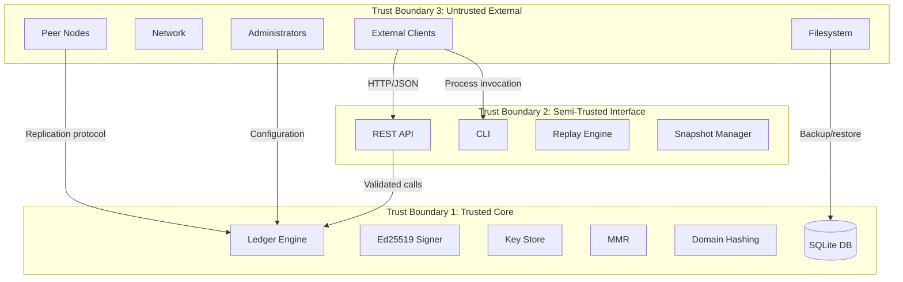

# VVU Earth Tech Ledger — Threat Model

## 1. Introduction

This document provides a comprehensive STRIDE threat model for the VVU Earth Tech Ledger. It identifies attack surfaces, threat actors, potential attacks, and mitigations. The model is designed to be used by security reviewers, auditors, and operators to understand the system's security posture.

## 2. System Boundaries

### 2.1 Trust Boundaries

### 2.2 Trust Assumptions

| Assumption | Rationale |
|------------|-----------|
| The host OS is not compromised | If the OS is compromised, all bets are off |
| Python runtime is not compromised | PyNaCl/libsodium are trusted |
| SQLite is not compromised | SQLite is a well-audited, ubiquitous library |
| Filesystem permissions are enforced | Database files must be protected by OS |
| Administrators are trusted | Admin actions are logged but not restricted |

## 3. STRIDE Analysis

### 3.1 Spoofing

| ID | Threat | Attack Vector | Impact | Mitigation |
|----|--------|---------------|--------|------------|
| S-01 | Unauthorized client impersonates legitimate client | API endpoint without authentication | Unauthorized ledger entries | Implement mTLS with client certificates (NetworkConfig.mtls_enabled) |
| S-02 | Attacker forges Ed25519 signature | Submitting a crafted 64-byte value | Invalid entry accepted as valid | Ed25519 signature verification with domain separation; 128-bit security |
| S-03 | Attacker impersonates peer node | Replication protocol without authentication | Ledger sync from malicious source | TLS/mTLS for replication; peer identity verification |
| S-04 | Attacker replays old signature in different domain | Cross-domain signature replay | Signature accepted under wrong domain | Domain separation: `SHA-256(domain ‖ len(domain)₄ ‖ message)` |
| S-05 | Attacker uses revoked key | Using a key_id that was revoked | Entry signed with revoked key | KeyStore rejects revoked keys; KeyExpiredError raised |

### 3.2 Tampering

| ID | Threat | Attack Vector | Impact | Mitigation |
|----|--------|---------------|--------|------------|
| T-01 | Database entry modification | Direct SQLite file modification | Ledger integrity compromised | Hash chain verification detects tampering; MMR root changes |
| T-02 | MMR node tampering | Modifying mmr_nodes table | Inclusion proofs fail | MMR rebuilt from entries; root comparison detects modification |
| T-03 | Payload modification | Changing payload bytes | Payload hash mismatch detected | `hash_payload(payload)` verified on read; replay verification |
| T-04 | Envelope pre-image tampering | Modifying sequence, parent_hash, or timestamp | Envelope hash mismatch | Canonical encoding is deterministic; `hash_envelope` verified |
| T-05 | Database file corruption | Disk errors, power failure | Data loss or inconsistency | SQLite WAL mode with `synchronous=FULL`; integrity_check on close |
| T-06 | Schema downgrade attack | Running `migrate_down` to remove constraints | Data integrity weakened | Migration operations are audited; schema version tracked |
| T-07 | Snapshot tampering | Modifying snapshot file during import | Restore from corrupted snapshot | `hash_snapshot(data)` integrity check on import; `SnapshotIntegrityError` |

### 3.3 Repudiation

| ID | Threat | Attack Vector | Impact | Mitigation |
|----|--------|---------------|--------|------------|
| R-01 | Deny having appended an entry | Claiming signature was forged | Non-repudiation broken | Ed25519 signatures provide non-repudiation; key versioning tracks signing key |
| R-02 | Deny quorum participation | Claiming validator signature was not provided | Quorum verification broken | Signatures are stored with key_id, key_version, and timestamp |
| R-03 | Deny key rotation event | Claiming key rotation was unauthorized | Key management audit broken | Audit logging for key rotation events; `log_key_rotation()` |

### 3.4 Information Disclosure

| ID | Threat | Attack Vector | Impact | Mitigation |
|----|--------|---------------|--------|------------|
| I-01 | Private key exposure | Memory dump, debug log, or serialization | All signatures compromised | Private keys stored as bytes, never hex-encoded; KeyPair.signing_key never exposed |
| I-02 | Database file read | Filesystem access to SQLite file | All ledger data exposed | OS-level file permissions; `secure_delete=ON` for deleted data |
| I-03 | API data exposure | Unauthenticated API access | All entries, proofs, and metadata exposed | TLS for API; authentication middleware; rate limiting |
| I-04 | Log information leakage | Structured logs containing sensitive data | Operational data exposed | LoggingConfig.severity controls log level; no private key material in logs |
| I-05 | Deleted data recovery | Forensic analysis of deleted pages | Previously deleted data recovered | `PRAGMA secure_delete=ON` zero-fills deleted pages |

### 3.5 Denial of Service

| ID | Threat | Attack Vector | Impact | Mitigation |
|----|--------|---------------|--------|------------|
| D-01 | Excessive append requests | Flood API with append calls | Ledger grows unbounded; storage exhaustion | Rate limiting; max payload size (MAX_OBJECT_SIZE=16MiB) |
| D-02 | Oversized payload | Submitting extremely large payloads | Memory exhaustion | `MAX_OBJECT_SIZE=16MiB`; `MAX_STRING_LENGTH=2MiB`; `MAX_DEPTH=64` |
| D-03 | Deep nesting in canonical encoding | Crafted deeply-nested dict/list | Stack overflow | `MAX_DEPTH=64` enforced in serializer |
| D-04 | Database lock contention | Concurrent writes from multiple connections | Write operations blocked | `busy_timeout=5000ms`; WAL mode for concurrent reads |
| D-05 | Replay of entire ledger | Triggering full replay on large ledger | CPU and I/O saturation | `max_replay_entries=1,000,000`; progress callback for monitoring |
| D-06 | Validator registration flood | Registering maximum validators | Registry exhaustion | `MAX_VALIDATORS=256` limit |

### 3.6 Elevation of Privilege

| ID | Threat | Attack Vector | Impact | Mitigation |
|----|--------|---------------|--------|------------|
| E-01 | SQL injection via API | Malformed input in API parameters | Arbitrary SQL execution | Parameterized queries throughout; no string interpolation in SQL |
| E-02 | SQL injection via migration | Malicious migration SQL | Schema modification | `trusted_schema=OFF` rejects dangerous SQL functions in triggers/views |
| E-03 | Key rotation by unauthorized party | Calling rotate_key() without authorization | Signing key replaced | Key rotation should be restricted to admin operations |
| E-04 | Validator weight manipulation | Setting weight to MAX_WEIGHT=1000 | Quorum capture by single validator | Weight validation in `ValidatorConfig.max_weight` |
| E-05 | Foreign key constraint bypass | Disabling foreign_keys pragma | Referential integrity broken | `foreign_keys=ON` enforced; cannot be disabled at runtime |

## 4. Attack Surfaces

### 4.1 Network Attack Surface

| Surface | Protocol | Exposure | Risk |
|---------|----------|----------|------|
| REST API | HTTP/JSON | Host:Port (default 0.0.0.0:50051) | HIGH if unauthenticated |
| Replication | SyncRequest/SyncResponse | Not yet implemented | MEDIUM (future) |
| Metrics | Prometheus text format | /metrics endpoint | LOW (read-only) |

**Mitigations:**
- TLS 1.3 with mTLS for API and replication
- Network segmentation (bind to internal IP)
- Rate limiting on API endpoints
- Firewall rules restricting access

### 4.2 Storage Attack Surface

| Surface | Format | Exposure | Risk |
|---------|--------|----------|------|
| SQLite database | Binary (WAL mode) | Filesystem | MEDIUM if permissions weak |
| Snapshot export files | Binary (VVUSNAP\x01 header) | Filesystem | LOW |
| Backup files | SQLite copy | Filesystem | MEDIUM |
| Configuration files | TOML | Filesystem | LOW |

**Mitigations:**
- File permissions: 0600 on database files
- `secure_delete=ON` for zero-filling deleted pages
- `synchronous=FULL` for crash safety
- Integrity check on database close and snapshot import

### 4.3 Cryptographic Attack Surface

| Surface | Algorithm | Key Size | Risk |
|---------|-----------|----------|------|
| Ed25519 signatures | Ed25519 | 256-bit (128-bit security) | LOW (quantum-vulnerable) |
| SHA-256 hashing | SHA-256 | 256-bit output | LOW (quantum-vulnerable) |
| Domain separation | SHA-256 prefix | 14-16 byte prefixes | NEGLIGIBLE |
| Key identifiers | SHA-256[:4] | 32-bit collision space | LOW (collision possible but not exploitable) |

**Mitigations:**
- Domain separation prevents cross-protocol attacks
- Key versioning enables rotation
- Key revocation prevents use of compromised keys
- Future: post-quantum signature scheme migration path

### 4.4 Replay Attack Surface

| Surface | Vector | Risk |
|---------|--------|------|
| Signature replay across domains | Cross-domain hash equivalence | MITIGATED by domain separation |
| Entry replay across ledgers | Same payload appended to different ledger | LOW (different parent_hash) |
| Timestamp manipulation | Timestamps in envelope pre-image | LOW (timestamp is part of hash chain) |

## 5. Threat Actors

### 5.1 Actor Profiles

| Actor | Capability | Motivation | Risk Level |
|-------|-----------|------------|------------|
| **External Attacker** | Network access, no credentials | Data theft, tampering, DoS | HIGH |
| **Malicious Insider** | Legitimate access, may have DB access | Data theft, tampering, cover-up | HIGH |
| **Compromised Peer** | Replication protocol access | Ledger poisoning, sync attacks | MEDIUM |
| **Rogue Validator** | Signing key, quorum participation | Quorum capture, false attestation | HIGH |
| **Negligent Operator** | Admin access, misconfiguration | Data loss, exposure | MEDIUM |

### 5.2 Attack Scenarios

#### Scenario 1: Quorum Capture

A malicious validator registers with maximum weight and then attempts to append entries without sufficient other validators.

**Mitigation:**
- `MAX_WEIGHT=1000` per validator
- `MIN_QUORUM=2` requires at least 2 validators
- 2/3 threshold means a single validator cannot achieve quorum alone
- `MAX_VALIDATORS=256` limits the attack surface

#### Scenario 2: Database Tampering

An attacker with filesystem access modifies the SQLite database directly.

**Mitigation:**
- Hash chain: modifying any entry changes its `envelope_hash`, breaking the chain
- MMR root: any modification changes the MMR root
- Replay verification: detects any tampering across the entire ledger
- Integrity check on close: `PRAGMA integrity_check`

#### Scenario 3: Key Compromise

An attacker obtains the Ed25519 private key.

**Mitigation:**
- Key revocation: `revoke_key(key_id, epoch)` prevents future use
- Key rotation: `rotate_key()` generates a new key pair
- Key versioning: all signatures carry `key_version` for audit
- Forward security: entries signed with old keys remain valid until revocation

## 6. Risk Matrix

| Risk ID | Threat | Likelihood | Impact | Risk | Mitigation Priority |
|---------|--------|-----------|--------|------|-------------------|
| R-01 | Unauthenticated API access | HIGH | HIGH | CRITICAL | P0 — Implement mTLS |
| R-02 | Private key exposure | MEDIUM | CRITICAL | HIGH | P1 — HSM integration |
| R-03 | Database tampering | MEDIUM | HIGH | HIGH | P1 — File permissions, encryption |
| R-04 | Quorum capture | LOW | HIGH | MEDIUM | P2 — Weight distribution policy |
| R-05 | DoS via append flood | HIGH | MEDIUM | HIGH | P1 — Rate limiting |
| R-06 | Oversized payload | MEDIUM | MEDIUM | MEDIUM | P2 — Already mitigated by limits |
| R-07 | Deep nesting DoS | LOW | MEDIUM | LOW | P3 — Already mitigated by MAX_DEPTH |
| R-08 | Snapshot tampering | LOW | MEDIUM | LOW | P3 — Already mitigated by hash check |
| R-09 | Cross-domain signature replay | NEGLIGIBLE | HIGH | LOW | P3 — Already mitigated by domain separation |
| R-10 | Quantum computing threat | NEGLIGIBLE | CRITICAL | MEDIUM | P2 — Plan migration path |

## 7. Residual Risks

### 7.1 Accepted Risks

| Risk | Rationale |
|------|-----------|
| Quantum computing threat to Ed25519/SHA-256 | Current timeline is 10+ years; migration path planned |
| No end-to-end encryption of ledger data | Ledger data is integrity-protected, not confidentiality-protected; encrypt at rest if needed |
| No API authentication by default | mTLS is optional; deployers must enable it |
| No rate limiting by default | Operators must implement rate limiting at the infrastructure level |
| No audit log persistence | Audit events are in-memory only; deployers must integrate with external logging |

### 7.2 Mitigation Roadmap

| Priority | Action | Timeline |
|----------|--------|----------|
| P0 | Implement mTLS authentication for API | Immediate |
| P1 | Add rate limiting to API endpoints | Short-term |
| P1 | Implement file-level encryption for database | Short-term |
| P2 | Add weight distribution policy for validators | Medium-term |
| P2 | Plan post-quantum signature migration | Medium-term |
| P3 | Add persistent audit log storage | Medium-term |

## 8. Security Checklist

### 8.1 Pre-Deployment

- [ ] Enable TLS (`tls_enabled=True`) in NetworkConfig
- [ ] Enable mTLS (`mtls_enabled=True`) for production deployments
- [ ] Set restrictive file permissions on database files (0600)
- [ ] Set restrictive file permissions on configuration files (0600)
- [ ] Set restrictive file permissions on key material (0400)
- [ ] Verify all PRAGMAs are applied (journal_mode=wal, synchronous=full, etc.)
- [ ] Configure rate limiting at infrastructure level
- [ ] Enable `secure_delete=ON` in DatabaseConfig
- [ ] Verify `trusted_schema=OFF` in DatabaseConfig
- [ ] Verify `foreign_keys=ON` in DatabaseConfig

### 8.2 Runtime

- [ ] Monitor `ledger_appends_total` for unusual spike
- [ ] Monitor `replay_duration_ms` for degradation
- [ ] Run periodic replay verification
- [ ] Monitor validator count and weight distribution
- [ ] Review audit logs for suspicious activity
- [ ] Verify MMR root matches expected value

### 8.3 Incident Response

- [ ] If private key is compromised: revoke key immediately, rotate to new key
- [ ] If database is tampered: run replay verification, identify violated entries
- [ ] If quorum is captured: revoke compromised validators, add new validators
- [ ] If API is under DoS: enable rate limiting, block offending IPs
