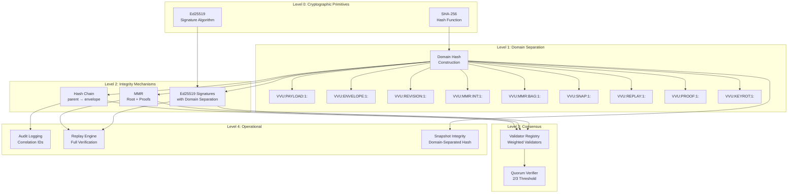

# VVU Earth Tech Ledger — Trust Model

## 1. Introduction

This document defines the formal trust model for the VVU Earth Tech Ledger. It describes the trust hierarchy, trust contexts, domain separation, trust escalation, trust decay, trust transfer, and cross-context trust properties.

## 2. Trust Hierarchy



### Trust Levels

| Level | Component | Trust Basis |
|-------|-----------|-------------|
| 0 | Cryptographic Primitives | Mathematical guarantees (collision resistance, forgery resistance) |
| 1 | Domain Separation | Prefix uniqueness prevents cross-domain attacks |
| 2 | Integrity Mechanisms | Hash chain, MMR, and signatures provide tamper evidence |
| 3 | Consensus | Quorum ensures distributed agreement |
| 4 | Operational | Audit, replay, and snapshots provide operational assurance |

## 3. Trust Contexts

### 3.1 Context Definitions

| Context | Scope | Trust Assumptions |
|---------|-------|-------------------|
| **Single-Node** | One ledger instance, no validators | The operator is trusted; no quorum needed |
| **Multi-Validator** | One ledger instance, multiple validators | Validators are trusted to sign honestly |
| **Multi-Node** | Multiple ledger instances, replication | Peers are trusted to sync honestly |
| **Audit** | External verifier with read-only access | The verifier can independently verify all properties |

### 3.2 Context Trust Requirements

| Property | Single-Node | Multi-Validator | Multi-Node | Audit |
|----------|-------------|-----------------|------------|-------|
| Hash chain integrity | Required | Required | Required | Required |
| MMR proofs | Required | Required | Required | Required |
| Signature verification | Required | Required | Required | Required |
| Quorum verification | Not required | Required | Required | Required |
| Replication integrity | Not required | Not required | Required | Not required |
| Replay verification | Available | Required | Required | Required |

## 4. Domain Separation

### 4.1 Purpose

Domain separation prevents cross-protocol attacks by ensuring that hashes and signatures computed under one domain cannot be confused with those computed under another domain.

### 4.2 Construction

```
domain_hash(domain, data) = SHA-256(domain ‖ len(domain)₄ ‖ data)
```

Where `len(domain)₄` is the domain length as a 4-byte big-endian unsigned integer.

### 4.3 Domain Prefixes

| Domain | Prefix | Bytes (hex) |
|--------|--------|-------------|
| Payload | `VVU:PAYLOAD:1:` | `56 56 55 3a 50 41 59 4c 4f 41 44 3a 31 3a` |
| Envelope | `VVU:ENVELOPE:1:` | `56 56 55 3a 45 4e 56 45 4c 4f 50 45 3a 31 3a` |
| Revision | `VVU:REVISION:1:` | `56 56 55 3a 52 45 56 49 53 49 4f 4e 3a 31 3a` |
| MMR Internal | `VVU:MMR:INT:1:` | `56 56 55 3a 4d 4d 52 3a 49 4e 54 3a 31 3a` |
| MMR Bagging | `VVU:MMR:BAG:1:` | `56 56 55 3a 4d 4d 52 3a 42 41 47 3a 31 3a` |
| Snapshot | `VVU:SNAP:1:` | `56 56 55 3a 53 4e 41 50 3a 31 3a` |
| Replay | `VVU:REPLAY:1:` | `56 56 55 3a 52 45 50 4c 41 59 3a 31 3a` |
| Proof | `VVU:PROOF:1:` | `56 56 55 3a 50 52 4f 4f 46 3a 31 3a` |
| Key Rotation | `VVU:KEYROT:1:` | `56 56 55 3a 4b 45 59 52 4f 54 3a 31 3a` |

### 4.4 Domain Separation Properties

**Property 1: Prefix Uniqueness.** All domain prefixes are unique. No two domains share the same prefix.

**Property 2: Length Encoding.** The `len(domain)₄` field ensures that a domain prefix cannot be a prefix of another domain prefix (preventing length-extension attacks across domains).

**Property 3: Version Tagging.** The `:1:` suffix allows the protocol to evolve without breaking existing hashes. New versions (e.g., `VVU:PAYLOAD:2:`) would be cryptographically independent.

## 5. Trust Escalation

### 5.1 Definition

Trust escalation occurs when a component at a lower trust level influences a component at a higher trust level.

### 5.2 Escalation Paths

| From | To | Mechanism | Risk |
|------|----|-----------|------|
| Cryptographic primitives | Domain separation | Hash function output determines domain hash | LOW (mathematical guarantee) |
| Domain separation | Hash chain | Domain hash determines chain integrity | LOW (deterministic) |
| Hash chain | Validator registry | Chain integrity enables validator verification | LOW (hash chain is tamper-evident) |
| Validator registry | Quorum | Validator weight determines quorum | MEDIUM (weight can be manipulated) |
| Quorum | Ledger append | Quorum determines entry acceptance | HIGH (quorum capture risk) |

### 5.3 Escalation Mitigations

| Escalation | Mitigation |
|------------|------------|
| Weight manipulation | `MAX_WEIGHT=1000`, `MIN_QUORUM=2` |
| Quorum capture | 2/3 threshold requires broad agreement |
| Key compromise | Key revocation and rotation |
| Single validator dominance | Weight distribution policy |

## 6. Trust Decay

### 6.1 Definition

Trust decay is the reduction in trust over time due to:

- Key aging (longer keys are more likely to be compromised)
- Validator churn (active validators change over time)
- Schema evolution (older schemas may have weaker guarantees)
- Cryptographic advances (algorithms may become weaker)

### 6.2 Decay Factors

| Factor | Decay Rate | Mitigation |
|--------|-----------|------------|
| Key age | Configurable (`key_expiry_days=365`) | Key rotation |
| Validator inactivity | Measured by `last_seen` timestamp | Peer health monitoring |
| Schema version | Tracked by `metadata.schema_version` | Migrations |
| Cryptographic strength | SHA-256/Ed25519 are currently secure | Post-quantum migration path |

### 6.3 Trust Decay Model

```
trust(key, t) = {
    1.0     if t < created_at + key_expiry_days
    0.5     if t < created_at + 2 * key_expiry_days (grace period)
    0.0     if key is revoked or t >= created_at + 2 * key_expiry_days
}
```

## 7. Trust Transfer

### 7.1 Definition

Trust transfer occurs when trust established in one context is applied to another context.

### 7.2 Transfer Scenarios

| Source | Target | Mechanism | Validity |
|--------|--------|-----------|----------|
| Single-node ledger | Multi-validator ledger | Register validators after initialization | Valid (hash chain is preserved) |
| Snapshot | Restored ledger | Import snapshot with integrity check | Valid (hash_snapshot verified) |
| Backup | Restored database | SQLite backup API with integrity check | Valid (PRAGMA integrity_check) |
| Peer sync | Local ledger | Replication protocol | Not yet implemented |

### 7.3 Transfer Constraints

1. **Hash chain must be preserved** — The `parent_hash` → `envelope_hash` chain must be intact
2. **MMR root must be consistent** — The rebuilt MMR root must match the stored root
3. **Signatures must be valid** — All signatures must be verifiable with the correct public keys
4. **Validator history must be consistent** — All signing keys must be traceable to active validators

## 8. Cross-Context Trust

### 8.1 Cross-Domain Independence

Hashes and signatures computed under different domains are cryptographically independent. This means:

- A payload hash cannot be used as an envelope hash
- A revision signature cannot be used as a payload signature
- An MMR internal hash cannot be used as an MMR bagging hash

### 8.2 Cross-Ledger Independence

Two independent ledger instances produce different hash chains because:

- The first entry has a different `parent_hash` (GENESIS_HASH)
- The sequence numbers are different
- The timestamps are different
- The signing keys are different

This means that entries from one ledger cannot be replayed on another ledger.

### 8.3 Cross-Validator Independence

Each validator has a unique `key_id` and `public_key`. This means:

- A signature from one validator cannot be attributed to another
- A revoked validator's key cannot be used by another validator
- Weight is tied to the validator's `key_id`, not to the validator's identity

## 9. Formal Trust Properties

### 9.1 Property T1: Integrity

**Statement:** If the ledger has not been tampered with, the replay engine produces zero violations.

**Proof:** Each check in the replay engine verifies a specific integrity property. If the ledger is correctly constructed, all checks pass.

### 9.2 Property T2: Tamper Evidence

**Statement:** Any modification to the ledger is detectable by the replay engine.

**Proof:** The hash chain links every entry to its predecessor. Modifying any entry changes its `envelope_hash`, which breaks the parent chain. The MMR root provides a compact commitment to the entire ledger.

### 9.3 Property T3: Non-Repudiation

**Statement:** A validator cannot deny having signed an entry.

**Proof:** Ed25519 signatures are deterministic and verifiable. The signature includes the `key_id` and `key_version`, which identify the signing key.

### 9.4 Property T4: Domain Isolation

**Statement:** Operations in one domain cannot affect operations in another domain.

**Proof:** The domain hash construction `SHA-256(domain ‖ len(domain)₄ ‖ data)` produces different outputs for different domains, even with the same data. This is a property of the SHA-256 hash function.

### 9.5 Property T5: Quorum Agreement

**Statement:** A quorum of validators must agree before an entry is accepted.

**Proof:** The quorum verifier checks that the total weight of signing validators meets the threshold. The threshold is `ceil(0.67 * total_weight)`, ensuring a supermajority.

### 9.6 Property T6: Forward Integrity

**Statement:** Revoking a key does not affect the validity of entries signed before the revocation.

**Proof:** The replay engine checks that the validator was active at the time of signing (`registration_sequence <= entry.sequence` and `revocation_sequence > entry.sequence`). Entries signed before the revocation are valid.

## 10. Trust Assumptions Summary

| Assumption | Risk if Violated | Mitigation |
|------------|-----------------|------------|
| SHA-256 is collision-resistant | Hash chain can be forged | Standardized, widely audited |
| Ed25519 is unforgeable | Signatures can be forged | Standardized, widely audited |
| Domain prefixes are unique | Cross-domain attacks | Verified by construction |
| Private keys are kept secret | Unauthorized signing | Key revocation, HSM |
| SQLite is not corrupted | Data integrity | WAL mode, integrity checks |
| Validators are honest | Quorum capture | Weight distribution, monitoring |
| Administrators are trusted | Misconfiguration | Audit logging, access control |
