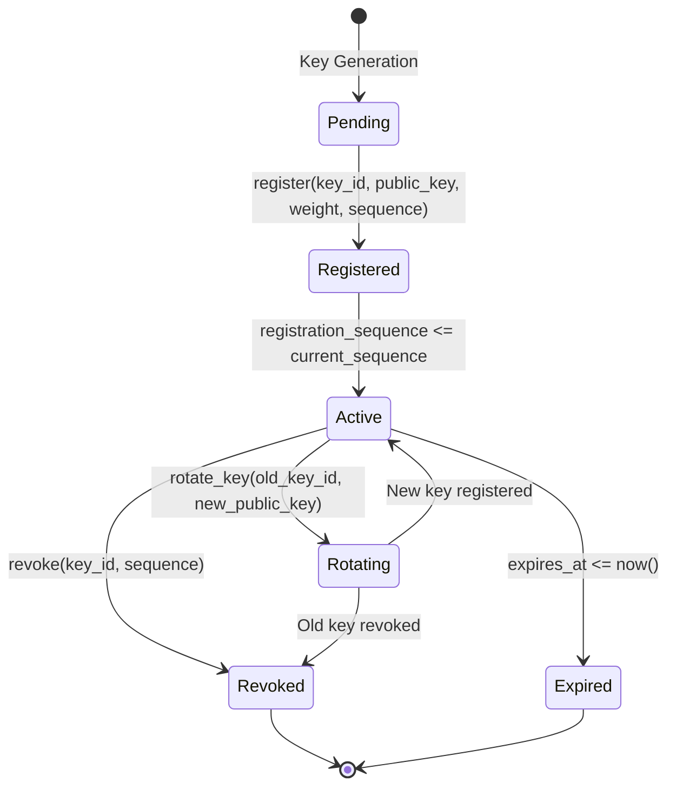
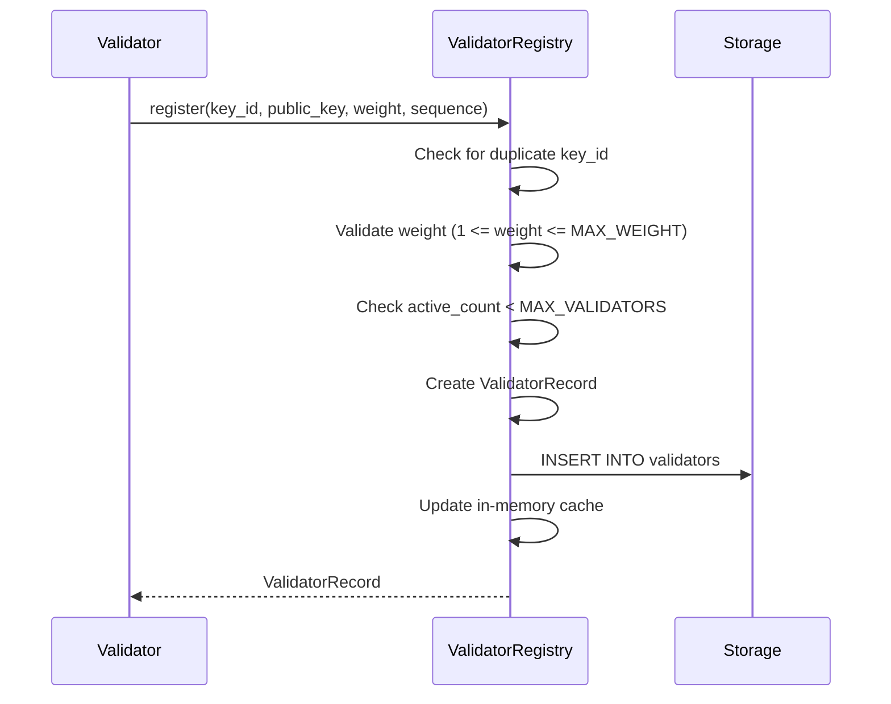
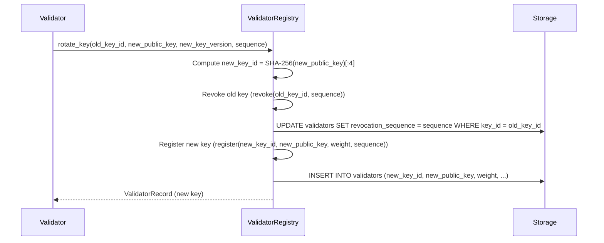
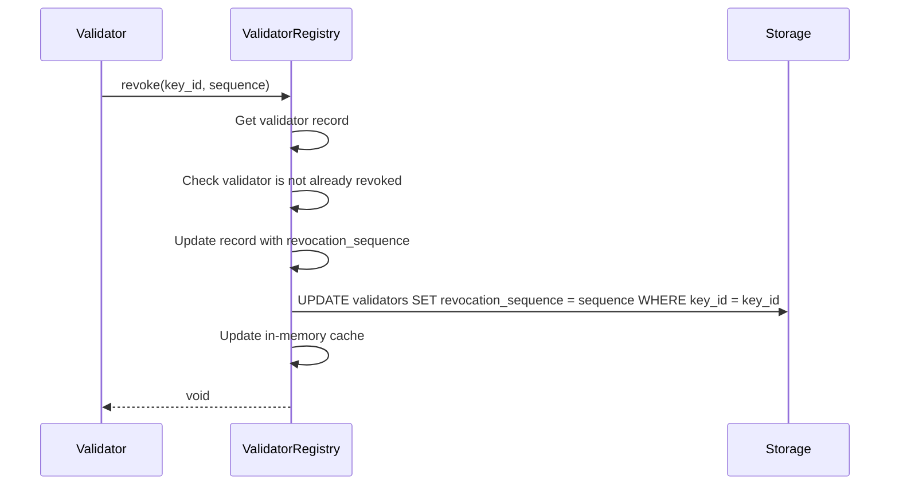
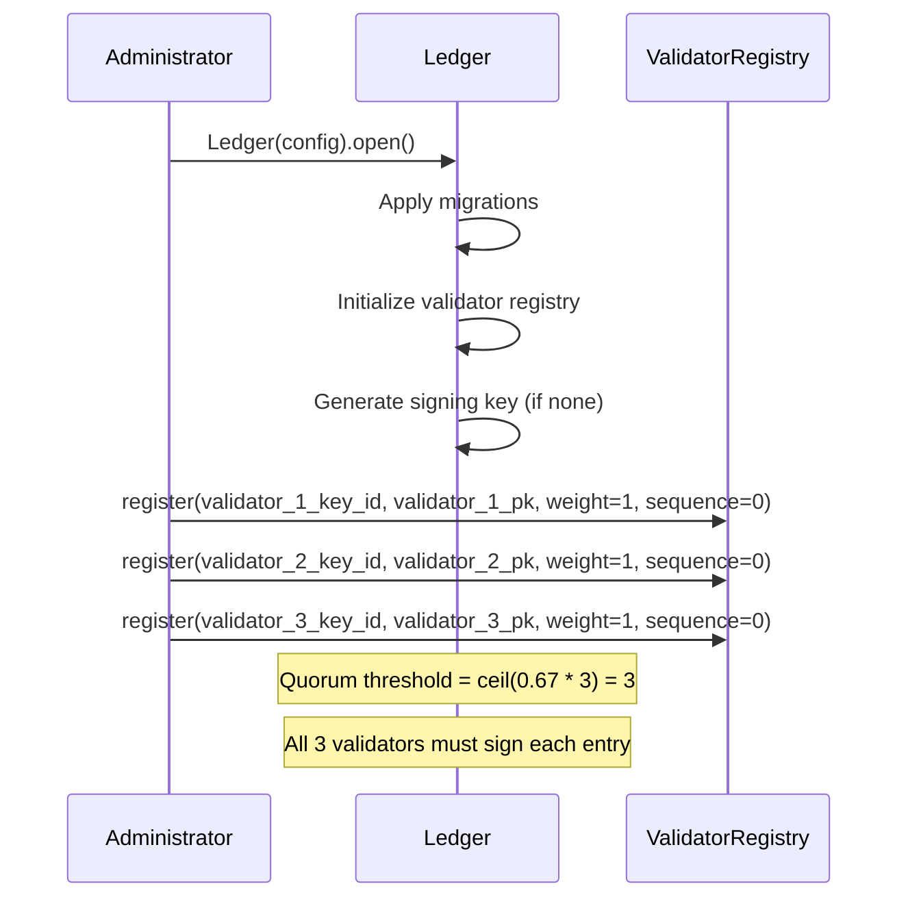

# VVU Earth Tech Ledger — Validator Lifecycle

## 1. Introduction

The Validator Lifecycle document describes the complete lifecycle of validators in the VVU Earth Tech Ledger, from onboarding through operation to decommissioning. Validators are the trusted entities that sign ledger entries, and their lifecycle management is critical to the system's security and integrity.

## 2. Overview



## 3. Validator Record

Each validator is represented by a `ValidatorRecord`:

| Field | Type | Description |
|-------|------|-------------|
| `key_id` | bytes (4) | 4-byte key identifier (SHA-256[:4] of public key) |
| `public_key` | bytes (32) | 32-byte Ed25519 public key |
| `weight` | int | Consensus weight (1–1000) |
| `registration_sequence` | int | Sequence number when the validator was registered |
| `revocation_sequence` | int or None | Sequence number when revoked (None if active) |
| `key_version` | int | Key version number (incremented on rotation) |
| `created_at` | float | Registration timestamp (POSIX epoch seconds) |
| `expires_at` | float or None | Optional expiry timestamp |

## 4. Onboarding and Registration

### 4.1 Prerequisites

Before a validator can be registered, the following must be in place:

1. **Ed25519 key pair** — The validator must generate a key pair. The public key is shared with the ledger; the private key is kept secret.
2. **Key identifier** — The `key_id` is computed as `SHA-256(public_key)[:4]`, providing a compact, collision-resistant tag.
3. **Weight assignment** — The validator's consensus weight must be determined (1–1000).

### 4.2 Registration Process



### 4.3 Registration Constraints

| Constraint | Value | Rationale |
|------------|-------|-----------|
| Maximum active validators | 256 | Prevents DoS via validator flooding |
| Minimum weight | 1 | Every validator must have at least some weight |
| Maximum weight | 1000 | Prevents quorum capture by a single validator |
| No duplicate key_id | — | Prevents key confusion |

### 4.4 Registration Failure Modes

| Error | Condition | Code |
|-------|-----------|------|
| `DuplicateValidatorError` | key_id already registered | `VALIDATOR_DUPLICATE` |
| `WeightInvalidError` | weight < 1 or weight > MAX_WEIGHT | `VALIDATOR_WEIGHT_INVALID` |
| `ValidatorError` | Active count >= MAX_VALIDATORS | `VALIDATOR_MAX_REACHED` |

## 5. Key Rotation

### 5.1 Why Rotate Keys?

Key rotation is necessary when:

- A private key is suspected of being compromised
- A regulatory compliance policy requires periodic rotation
- The key has reached its expiry timestamp
- An operational need to update the signing key

### 5.2 Rotation Process



### 5.3 Rotation Properties

- The new key inherits the same weight as the old key
- The old key is revoked at the current sequence number
- The new key has a new `key_id` and incremented `key_version`
- Entries signed with the old key before the rotation remain valid

### 5.4 Rotation Domain

Key rotation operations use the `VVU:KEYROT:1:` domain for integrity hashing:

```
hash_key_rotation(data) = domain_hash(VVU:KEYROT:1:, data)
```

## 6. Weight Assignment

### 6.1 Weight Semantics

A validator's weight determines its influence in quorum decisions:

- **Weight 1** — Equal influence (1 validator = 1 vote)
- **Weight > 1** — Enhanced influence (e.g., a more trusted validator)

### 6.2 Weight Distribution Recommendations

| Topology | Recommended Distribution |
|----------|-------------------------|
| Equal trust | All validators: weight = 1 |
| Tiered trust | Core validators: weight = 3, Edge validators: weight = 1 |
| Federated | Organization representatives: weight = organizational stake |

### 6.3 Quorum Threshold Computation

The required weight for quorum is:

```
required_weight = ceil(threshold_pct * total_weight)
```

Where:
- `threshold_pct` = 0.67 (default, 2/3 supermajority)
- `total_weight` = sum of active validator weights

**Example:**
- 3 validators with weights [1, 1, 1]: total_weight = 3, required = ceil(0.67 * 3) = 3
- 5 validators with weights [1, 1, 1, 1, 1]: total_weight = 5, required = ceil(0.67 * 5) = 4
- 3 validators with weights [3, 2, 1]: total_weight = 6, required = ceil(0.67 * 6) = 5

## 7. Revocation

### 7.1 Revocation Process



### 7.2 Revocation Constraints

- A revoked key cannot be used for signing or verification
- A revoked key cannot be revoked again
- A key that doesn't exist cannot be revoked

### 7.3 Revocation Failure Modes

| Error | Condition | Code |
|-------|-----------|------|
| `ValidatorNotFoundError` | key_id not found in registry | `VALIDATOR_NOT_FOUND` |
| `ValidatorExpiredError` | key_id already revoked | `VALIDATOR_EXPIRED` |

## 8. Expiry

### 8.1 Key Expiry

Validators can optionally set an `expires_at` timestamp during registration. After this time, the validator's key should be considered expired and a rotation should be performed.

### 8.2 Expiry Configuration

The default key expiry is configured in `ValidatorConfig`:

| Parameter | Default | Description |
|-----------|---------|-------------|
| `key_expiry_days` | 365 | Days after which a key should be rotated |

### 8.3 Expiry vs. Revocation

| Property | Expiry | Revocation |
|----------|--------|------------|
| Automatic | Yes (based on timestamp) | No (requires explicit action) |
| Reversible | No | No |
| Affects future entries | Yes | Yes |
| Affects past entries | No | No |

## 9. Validator Set Evolution

### 9.1 Historical Queries

The validator registry supports historical queries: asking for the state of a validator at a specific sequence number.

```
get_at_sequence(key_id, sequence) → ValidatorRecord or None
```

A validator is considered **active** at a given sequence if:
- `registration_sequence <= sequence`
- `revocation_sequence is None or revocation_sequence > sequence`

### 9.2 Validator Set at a Point in Time

```
list_active(sequence) → list[ValidatorRecord]
```

Returns all validators that were active at the given sequence number.

### 9.3 Total Weight at a Point in Time

```
total_weight(sequence) → int
```

Returns the sum of weights of all active validators at the given sequence.

## 10. Bootstrap Procedure

### 10.1 Single-Node Bootstrap

For a single-node deployment (no validators):

1. Initialize the ledger with `LedgerConfig.default()`
2. The ledger auto-generates a signing key
3. All entries are signed by the single key
4. No quorum verification is performed

### 10.2 Multi-Validator Bootstrap

For a multi-validator deployment:

1. Initialize the ledger with `LedgerConfig.default()`
2. Register each validator with their public key and weight
3. The quorum verifier is automatically initialized
4. Subsequent appends must include sufficient validator signatures

### 10.3 Bootstrap Sequence



## 11. Security Considerations

### 11.1 Quorum Capture Prevention

A single validator with weight >= 2/3 of total weight can achieve quorum alone. To prevent this:

- Limit `MAX_WEIGHT` to a reasonable value
- Require a minimum number of validators (`MIN_QUORUM = 2`)
- Monitor weight distribution for anomalies

### 11.2 Key Compromise Response

If a validator's private key is compromised:

1. Immediately revoke the key: `revoke(key_id, current_sequence)`
2. Register a new key: `register(new_key_id, new_public_key, weight, sequence)`
3. Or use `rotate_key()` to perform both steps atomically

### 11.3 Validator Churn

Excessive validator registration and revocation can destabilize the quorum. To mitigate:

- Monitor `validator_count` and `total_weight` metrics
- Set alert thresholds for rapid changes
- Require administrative approval for validator changes

## 12. CLI Operations

### 12.1 Register a Validator

```bash
ledger validators --register <hex-encoded-public-key>
```

### 12.2 Revoke a Validator

```bash
ledger validators --revoke <hex-encoded-key-id>
```

### 12.3 Rotate a Validator Key

```bash
ledger validators --rotate <hex-encoded-old-key-id>
```

### 12.4 List Active Validators

```bash
ledger validators
```

## 13. API Endpoints

### 13.1 List Validators

```
GET /validators
```

Returns:
```json
{
    "validators": [
        {
            "key_id": "a1b2c3d4",
            "public_key": "...",
            "weight": 1,
            "registration_sequence": 0,
            "key_version": 1,
            "created_at": 1234567890.0,
            "expires_at": null
        }
    ],
    "count": 1,
    "total_weight": 1
}
```

## 14. Metrics

| Metric | Type | Description |
|--------|------|-------------|
| `ledger_validator_count` | Gauge | Number of active validators |
| `ledger_total_weight` | Gauge | Total weight of active validators |
| `validator_registrations_total` | Counter | Total number of registrations |
| `validator_revocations_total` | Counter | Total number of revocations |
| `validator_key_rotations_total` | Counter | Total number of key rotations |
